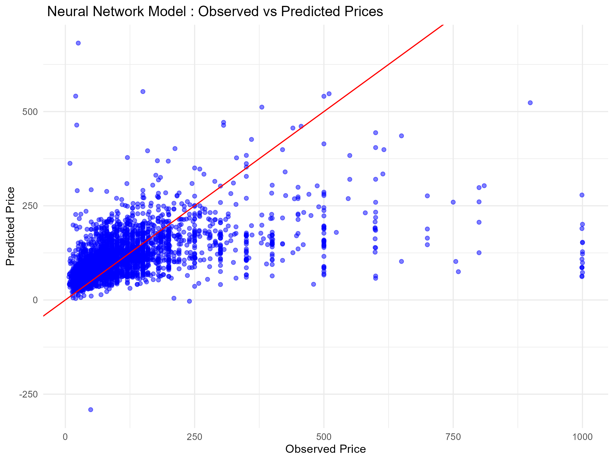

```{r download packages, include = FALSE}
options(repos = c(CRAN = "https://cran.rstudio.com/"))
#file.edit("~/.Rprofile")
```

```{r setup!, include=FALSE}
knitr::opts_chunk$set(echo = TRUE)
#options(repos = c(CRAN = "https://cran.rstudio.com/"))
```

```{r pressure., echo=FALSE, warning=FALSE, out.width='60%', fig.align='center', fig.cap="Barcelona's Digital Landscape: a data-driven exploration of urban dynamics around Sagrada Familia. AI-generated by our team."}
knitr::include_graphics("Barcelona Picture.png")
```

```{r Packages, include=FALSE}
# Instal requiered packages
install.packages(c("dplyr", "ggplot2", "tidyr", "RColorBrewer", "leaflet", "shiny", "leaflet.extras", "corrplot", "treemap", "wordcloud", "mgcv", "gratia", "rsample", "Metrics", "forcats", "VGAM", "e1071", "NeuralNetTools"))
```

```{r libraries, include=FALSE}
# Load required libraries
library(dplyr)        # Data manipulation and wrangling
library(ggplot2)      # Data visualization
library(tidyr)        # Data tidying
library(RColorBrewer) # Color palettes for visualizations
library(leaflet)      # Interactive maps
library(shiny)        # Building interactive web applications
library(leaflet.extras) # Additional features for leaflet maps
library(corrplot)     # Visualization of correlation matrices
library(mice)         # Handling missing data
library(nnet)         # Multinomial regression model
library(forcats)      # Handling categorical variables
library(patchwork)    # Combining multiple ggplots
library(VGAM)         # Multinomial logistic regression models
library(tidyverse)    # Collection of data science packages
library(e1071)        # Support Vector Machines (SVM)
library(reshape2)     # Data reshaping for ggplot visualizations
library(caret)        # Machine learning and model evaluation
library(wordcloud)    # Wordcloud plot
library(rsample)      # Split dataset into training and testing
library(mgcv)         # Gam Mdels
library(neuralnet)    # Neural Netwotk
library(NeuralNetTools) # Plot Neural network
```

# 1. Introduction

## 1.1 Presentation of the case

A tourism company based in Zürich, Switzerland, has observed a significant increase in travel demand to Barcelona in recent years. Indeed, Barcelona ranks as the third most in-demand city for Airbnb rentals in Europe, behind Paris and London.

Consequently, the company’s manager has requested a Machine Learning study and analysis of Airbnb accommodations in the city. The goal is to understand price behavior and identify the factors influencing accommodation costs and occupancy, enabling the company to provide optimal responses to clients' inquiries.

To achieve this goal, the team has decided to analyse and address three question to provide comprehensive insights for the manager.

1. **What are the key factors influencing accommodation prices in Barcelona?**
2. **Can we predict occupancy rates based on location, amenities, or other factors?**
3. **How accurately can machine learning predict Airbnb prices in Barcelona? Which models perform best for this dataset?**

## 1.2 Motivations
Barcelona is one of the most visited cities in Europe, and the rise of Airbnb and other short-term rental platforms has led to a notable increase in tourism. However, this growth also presents challenges for accommodation businesses and the local housing market. A study conducted by the Social Science Research Network (<span style="color:blue">SSRN, link: https://papers.ssrn.com/sol3/papers.cfm?abstract_id=3428237</span>) revealed that rental costs in neighborhoods with high Airbnb activity increased by 7% between 2009 and 2016. This is primarily due to the fact that property owners, motivated by the demand from tourists seeking short-term rentals, frequently opt to lease their properties at higher rates during the short term rather than committing to long-term leases.

For these reasons, it is crucial for tourism companies to understand this dynamic market to remain competitive and provide tailored services to their clients.

The Zürich-based tourism company needs reliable data on Airbnb prices and occupancy rates to make data-driven recommendations and stay ahead of competitors.

## 1.3 Disclaimer
This analysis is for educational purposes only. The findings are based on public data and are not professional advice. The results should not be used for business or policy decisions.

## 1.4 Dataset selected

To conduct the study, the team has decided to analyse a dataset of Barcelona Airbnbs available on the Kaggle website (<span style="color:blue">link: https://www.kaggle.com/datasets/fermatsavant/airbnb-dataset-of-barcelona-city</span>)

The dataset consists of 19.833 observations across 25 variables, including geographical zones, amenities, prices, and accommodations.


```{r dataset download, include=FALSE}
# import the dataset
BCN_Accomm_full <- read.csv("Cleaned_airbnb_barcelona.csv")
```

Below, we can see the structure of the dataset, and the names and data types for each column.

```{r Structure dataset, echo = FALSE}
# Structure
glimpse(BCN_Accomm_full)
```

### Numerical values:
- **`X`**: numerical index for rows
- **`id`**: unique identifier for listings
- **`host_id`**: unique identifier for hosts
- **`host_listings_count`**: number of listings by the host
- **`latitude`**: geographic latitude of the listing
- **`longitude`**: geographic longitude of the listing
- **`accommodates`**: number of guests the listing can accommodate
- **`bathrooms`**: number of bathrooms in the listing
- **`bedrooms`**: number of bedrooms in the listing
- **`beds`**: number of beds in the listing
- **`minimum_nights`**: minimum number of nights required for booking
- **`availability_30`**: number of available nights in the next 30 days
- **`availability_60`**: number of available nights in the next 60 days
- **`availability_90`**: number of available nights in the next 90 days
- **`availability_365`**: number of available nights in the next 365 days
- **`number_of_reviews_ltm`**: number of reviews in the last 12 months
- **`review_scores_rating`**: average review rating score

### Binary variables:
- **`host_is_superhost`**: indicates if the host is a superhost (`"t"` or `"f"`)
- **`has_availability`**: indicates if the listing is available for booking (`"t"` or `"f"`)

### String values:
- **`neighbourhood`**: name of the neighbourhood where the listing is located
- **`zipcode`**: postal code of the listing
- **`property_type`**: type of property (e.g., "Apartment")
- **`room_type`**: type of room (e.g., "Entire home/apt")
- **`amenities`**: list of amenities provided in the listing
- **`price`**: price of the listing as a string (e.g., "$130.00")


As can be appreciated, the variable 'price' has a 'Character' data type. Therefore, in the chapter 3, this field will be transformed into an integer variable to enable the necessary calculations.

## 1.5 Sub-sampling

In order to streamline the calculations and analysis, a sub-dataset will be created in the following steps, considering 10.000 observations selected randomly. Additionally, a seed is created to ensure the same observations are maintained throughout the analysis

```{r sub-set, echo=FALSE}
set.seed(100)
BCN_Accomm_sub <- sample_n(BCN_Accomm_full, 10000) 
glimpse(BCN_Accomm_sub)
```

# 2. Methodology

To address the research question, the study will be divided into three parts. First, an Exploratory Data Analysis (EDA) will be conducted to gain a deeper understanding of the data. Second, Machine Learning models will be implemented, and their performance will be evaluated to identify the best-performing model. Finally, the selected model will be used to provide the most accurate answer to the research question posed by the team.

The different models to be developed are: 

1. Linear Model (FB)
2. Generalised Linear Model with family set to Poisson for binary data (FB)
3. Generalised Linear Model with family set to Binomial for binomial and multinomial data (MD)
4. Generalised Additive Model for (CR)
5. Neural Network for (CR)
6. Support Vector Machine for (MD)

# 3 Exploratory Data Analysis

## 3.1 Converting Price variable to numeric

First, the pricing variable will be converted into a numeric format, and in the fifth chapter of this report (Machine Learning Models), the categorical variables will be transformed into factors for further analysis and modeling.

```{r Convert price to numeric}
BCN_Accomm_sub$price <- gsub(",", "", BCN_Accomm_sub$price) # removed ','
BCN_Accomm_sub$price <- gsub("\\$", "", BCN_Accomm_sub$price) # removed '$' sign
BCN_Accomm_sub$price <- as.numeric(BCN_Accomm_sub$price)  # converted to number format
```

## 3.2 Missing values (detect and treat) (MD) 

```{r miss-values, include=FALSE}
print('Location of missing values')
# find location of missing values column wise
sapply(BCN_Accomm_sub, function(x) which(is.na(x)))

```

```{r Count missing values per columns, echo =FALSE}
# count the missing values column wise
sapply(BCN_Accomm_sub, function(x) sum(is.na(x)))
```

```{r patt-miss-values, echo = FALSE}
md.pattern(BCN_Accomm_sub, rotate.names = TRUE)
```

```{r tab-miss-values, echo = FALSE}
# Total observations
total_rows <- nrow(BCN_Accomm_sub) 

# Calculate missing values (count and percentage)
missing_values <- data.frame(
  #Variable = names(BCN_Accomm_full),
  Missing_Count = colSums(is.na(BCN_Accomm_sub)),
  Missing_Percent = paste0(round((colSums(is.na(BCN_Accomm_sub)) / total_rows) * 100, 2), "%"))

# Order DataFrame table in descending order
missing_values <- missing_values[order(-missing_values$Missing_Count), ]

# Display the table
knitr::kable(missing_values, 
             caption = "Missing Values by Variable",
             align = "c")
```

## 3.2.1 How to manage Missing values for each field (MD) 

host_listings_count : since is not possible to make any calculation on the number of listing of the host, we exclude the 22 rows that lack of it.
bathrooms : the number of bathrooms is missing in 6 rows. 
beds : the number of beds is not specified for 18 assets. 
bedrooms : 2 rows contains missing value and can be deleted.
review_scores_rating : the review score rating is missing in 2415 rows of 10000. It's a quite relevant percentage, around the 24% of the data we selected. In this case we decide to impute the missing values replacing it with the value 0.

```{r imputation_review_score_rating, echo = FALSE}
# Create a new data frame with the imputed review_scores_rating column
imp_BCN_Accomm_sub <- BCN_Accomm_sub %>%
  mutate(review_scores_rating = if_else(is.na(review_scores_rating), 0, review_scores_rating))

md.pattern(imp_BCN_Accomm_sub, rotate.names = TRUE)
```

Eventually, the other fields that present missing values do not allow to replace the empty data with estimates (average, mean, ...) so called imputation. This fields include in total 48 assets that represent 0.48% of the total assets and allows to delete the entire rows without loosing too much information.

```{r removing-rows, include = FALSE}
BCN_Accomm <- na.omit(imp_BCN_Accomm_sub) # from this point we'll use this data set
md.pattern(BCN_Accomm, rotate.names = TRUE)
```

## 3.3 Correlation matrix

```{r correlation_matrix_numeric_fields}
# Create a correlation matrix for numeric fields
cor_BNC_Accomm <- select_if(BCN_Accomm, is.numeric) %>%
  select(-c(id, X, host_id))

# make a data frame
cor_BNC_Accomm <- data.frame(cor_BNC_Accomm)
str(cor_BNC_Accomm)

# print correlation matrix
corrplot(cor(cor_BNC_Accomm), type = "upper", order = "hclust", tl.col = "black")
```

From the correlation matrix is possible to deduct the following characteristics:
- there's almost no correlation between availability periods and number of beds, bedrooms, bathrooms. It would suggest that the availability of the house do not depend from those features, rather probably from the location and facilities.
- there is a positive correlation between number of bedrooms, beds and bathrooms.
- there is a positive correlation between the availability periods. 

## 3.4 Outliers (boxplots) (detect and treat) (CR)
Since the price variable is a key focus of our analysis, an outlier analysis of this variable has been conducted.

### 3.4.1 Count of outliers in Price

```{r Outliers for the variable Price, echo = FALSE}
# Calculate Q1, Q3, and IQR for the price variable
Q1 <- quantile(BCN_Accomm$price, 0.25)
Q3 <- quantile(BCN_Accomm$price, 0.75)
IQR <- Q3 - Q1

# Add a column to indicate outliers 
BCN_Accomm_sub_outlier <- BCN_Accomm %>%
  mutate(is_outlier = price < (Q1 - 1.5 * IQR) | price > (Q3 + 1.5 * IQR))

# Count the number of outliers
outliers_count <- sum(BCN_Accomm_sub_outlier$is_outlier)

# Display outliers count
outliers_count

```

Out of a total of 10,000 values, 804 (8.04%) are identified as outliers. Below, a boxplot is presented to visualize the median and the outlier observations.

```{r Boxplot Price, echo= FALSE}
# Boxplot for price variable
boxplot(BCN_Accomm$price, 
        horizontal = TRUE,
        axes = FALSE, 
        staplewex = 1, 
        ylim = c(2, 500),
        main = "Boxplot of Price/Night Variable (€)")  

# X Axis
axis(1, las = 1)

# Add text labels values (Q1, Q3, IQR)
stats <- boxplot.stats(BCN_Accomm$price)$stats
text(x = stats, y = 1.25, labels = stats, pos = 3, cex = 0.9) 
```

From the boxplot above, it can be concluded that the median price is approximately 65€ per night, with 50% of the observations concentrated between 40€ (25th percentile) and 112€ (75th percentile), representing the interquartile range (IQR).

Additionally, the presence of numerous outliers extending to the right indicates a right-skewed distribution, meaning higher prices are influencing the dataset.

The significant number of observations with higher prices could suggest the presence of many luxury properties. Therefore, further analysis is required to identify the factors influencing these price variations.

### 3.4.2 Detecting Top 20 Price Outliers

```{r Filter outliers, echo = FALSE}
# Filter rows Outliers
outlier_extremes <- BCN_Accomm_sub_outlier%>%
  filter(is_outlier == TRUE) %>%
  select(neighbourhood, property_type, bedrooms, price) %>%
  arrange(desc(price), neighbourhood, property_type) %>%
  slice_head(n = 20)  # Select top 20 Outliers for price

# Display Prices outliers
knitr::kable(outlier_extremes, 
             caption = "Table 2: Top 20 and Outliers for Price Variable with Neighbourhood",
             align = "c")
```

It seems that the price variable may contain erroneous entries. For further analysis, research revealed that the average nightly rate for an Airbnb in Barcelona is €93 (according to <span style="color:blue">Hostel Geeks, link: https://hostelgeeks.com/best-airbnbs-in-barcelona-spain/</span>). Therefore, prices of €8,000 are likely errors. As a result, it was decided to exclude prices above €1,000 from the analysis.

The new summary for tha Price variable is the following:

```{r Filter price lesss than 1000, echo=FALSE}
# Filter dataset
BCN_Accomm <- BCN_Accomm %>%
  filter(price <= 1000)
summary(BCN_Accomm$price)
```

Now, a new Correlation Matrix with the filtered observations of the price variable is displayed.

```{r New correlation_matrix_numeric_fields, echo = FALSE}
# Create a correlation matrix for numeric fields
cor_BNC_Accomm_new <- select_if(BCN_Accomm, is.numeric) %>%
  select(-c(id, X, host_id))

# make a data frame
cor_BNC_Accomm_new <- data.frame(cor_BNC_Accomm_new)
str(cor_BNC_Accomm)

# print correlation matrix
corrplot(cor(cor_BNC_Accomm_new), type = "upper", order = "hclust", tl.col = "black")
```

We can observe that the price variable is now most correlated with variables related to the size and capacity of an Airbnb, such as bathrooms, bedrooms, number of beds, and accommodates.

On the other hand, general availability and review scores have little impact on the price.

### 3.5 Histograms for Numerical Variables(CR)

```{r Histograms Numerical Variables, echo=FALSE, warning=FALSE}

# Reshape the data set to long format
BCN_Accomm_hist <- BCN_Accomm %>%
  pivot_longer(cols = c(price,
                        accommodates,
                        bathrooms,
                        bedrooms,
                        beds,
                        minimum_nights,
                        number_of_reviews_ltm,
                        review_scores_rating
),  
               names_to = "variable", values_to = "value")

# Create histograms with facet_wrap
hist_num <- ggplot(BCN_Accomm_hist, aes(x = value)) +
  geom_histogram(bins = 30, fill = "skyblue", color = "black") +  
  labs(title = "Histograms for Numerical Variables", x = "Value", y = "Frequency") +
  facet_wrap(~variable, scales = "free") +  # each plot with their own y axes
  theme_minimal()

print(hist_num)
```

From the histograms above, several variables exhibit right-skewed distributions, including price, minimum_nights, and number_of_reviews_ltm.

On the other hand, the data suggests that in Barcelona, Airbnb listings are primarily designed for small groups of people seeking short-term stays. Additionally, these accommodations tend to receive high review scores, indicating good guest satisfaction with the different properties.

### 3.4 Pie Charts for Binary Variable "Host_is_superhost"

```{r Superhost Status, echo=FALSE, message=FALSE, warning=FALSE}
# Calculate percentages and relabel values
superhost_data <- BCN_Accomm %>%
  count(host_is_superhost) %>%
  mutate(
    percentage = n / sum(n) * 100,  # Calculate percentages
    host_is_superhost = recode(host_is_superhost, "f" = "False", "t" = "True")  # Relabel
  )

# Create the pie chart with percentages
pc_sh_status <- ggplot(superhost_data, aes(x = "", y = n, fill = host_is_superhost)) +
  geom_col() +
  coord_polar(theta = "y") +
  geom_text(aes(label = paste0(round(percentage, 1), "%")), position = position_stack(vjust = 0.5)) +  # Add percentages
  labs(
    title = "Proportion of Superhost Status",
    fill = "Superhost Status\n(False = Not a Superhost, True = Superhost)"
  ) +
  theme_void() +
  theme(
    plot.title = element_text(hjust = 0.5, face = "bold"),  # Center and bold title
    legend.title = element_text(size = 10),
    legend.text = element_text(size = 9)
  )

print(pc_sh_status)
```

Almost 19% of the hosts offering an Airbnb in Barcelona are not categorized as Superhosts. This means tourists can find accommodations in the city where hosts go above and beyond to provide excellent hospitality. This insight could be a key factor in explaining the higher price values observed in certain neighborhoods.

### 3.5 Plots for String Variables

This section presents a variety of plots for the categorical variables, including Property Type, Room Type, Top Neighbourhoods, and Amenities.

```{r Top 10 property types, echo=FALSE, message=FALSE, warning=FALSE}
# Filter for the top 10 property types and calculate percentages
top_property_types <- BCN_Accomm %>%
  count(property_type, sort = TRUE) %>%
  slice_max(n, n = 10) %>%  # Keep the top 10 most frequent property types
  mutate(percentage = n / sum(n) * 100)  # Calculate percentages

# Create the bar plot with percentages and labels
top_property <- ggplot(top_property_types, aes(x = reorder(property_type, percentage), y = percentage, fill = property_type)) +
  geom_col() +
  geom_text(aes(label = paste0(round(percentage, 1))), hjust = -0.2, size = 4) +  # Add percentage labels
  coord_flip() +  # Flip coordinates for better readability
  labs(title = "Top 10 Property Types by Percentage", x = "Property Type", y = "Percentage (%)") +
  theme_minimal() +
  theme(
    legend.position = "none",
    plot.title = element_text(hjust = 0.5, face = "bold"))  # Center and bold title)

print(top_property)
```

From the plot above, it can be observed that apartments dominate the Airbnb market in Barcelona, accounting for 86% of the listings.

On the other hand, the low availability of luxury or specialized accommodations, such as Boutique Hotels (0.5%), Guest Suites (0.7%), and Lofts (2.4%), suggests that these property types cater to a niche market. Travelers opting for these accommodations are likely visiting Barcelona for specific reasons, such as work or unique travel experiences.

```{r Barplots Room Type, echo=FALSE, message=FALSE, warning=FALSE}
# Reshape the dataset to long format 
BCN_Accomm_long <- BCN_Accomm %>%
  pivot_longer(cols = c(room_type), names_to = "variable", values_to = "value")

# Calculate the percentage for each category within the room_type variable
BCN_Accomm_percentage <- BCN_Accomm_long %>%
  group_by(variable, value) %>%
  summarize(count = n()) %>%
  mutate(percentage = count / sum(count) * 100)

# Create a barplot
room_type_plot <- ggplot(BCN_Accomm_percentage, aes(x = value, y = percentage, fill = variable)) +
  geom_bar(stat = "identity") + 
  labs(title = "Percentage Barplot for Room Type", x = "Category", y = "Percentage (%)") +
  theme_minimal() + 
  theme(
    legend.position = "none",
    plot.title = element_text(hjust = 0.5, face = "bold"))

print(room_type_plot)
```

The majority of Room Type are split between Entire home/Apartment and Private Room.

Less than 1% of the hosts offer Shared Room, which suggests that travellers prefer more privacy during the stay.

```{r Top 10 Neighbourhoods, echo=FALSE, message=FALSE, warning=FALSE}
# Filter for the top 10 neighbourhoods and calculate percentages
top_neighbourhoods <- BCN_Accomm %>%
  count(neighbourhood, sort = TRUE) %>%
  slice_max(n, n = 10) %>%
  mutate(percentage = n / sum(n) * 100)  # Calculate percentages

# Create the plot with percentages and labels
top_neighbourhoods <- ggplot(top_neighbourhoods, aes(x = reorder(neighbourhood, percentage), y = percentage, fill = neighbourhood)) +
  geom_col() +
  geom_text(aes(label = paste0(round(percentage, 1))), hjust = -0.2, size = 4) +  # Add percentage labels
  coord_flip() +
  labs(title = "Top 10 Neighbourhoods by Percentage", x = "Neighbourhood", y = "Percentage (%)") +
  theme_minimal() +
  theme(
    legend.position = "none",
    plot.title = element_text(hjust = 0.5, face = "bold"))

print(top_neighbourhoods)
```

The Eixample district of Barcelona represents the most popular neighbourhood on Airbnb, with 27% of the total listings. This is followed by Ciutat Vella, which accounts for 18.8% of the listings.

Eixample is situated in close proximity to the historic centre of the city and is more centrally located in comparison to other neighbourhoods. The area offers many attractions for tourists, including La Sagrada Familia, Casa Batlló, and Passeig de Gràcia. In addition to its excellent transport connections, Eixample is an ideal destination for visitors. 

On the other hand, Ciutat Vella is the oldest part of Barcelona and serves as the heart of the city, known for its historical charm and vibrant cultural scene. 

Given this, the Tourism Company in Zürich could recommend that its clients focus on these neighbourhoods to attract more customers and enhance their travel experience.

### Worldcloud for Amaneties

```{r Wordcloud for amanities, echo=FALSE, message=FALSE, warning=FALSE}
# Combine all amenities into a single text string and clean it
amenities_text <- BCN_Accomm$amenities %>%
  paste(collapse = " ") %>%                # Combine all rows into one string
  gsub("\\[|\\]|'", "", .)                 # Remove brackets and quotes from the field

# Split the text into words and calculate word frequencies
word_freq <- table(unlist(strsplit(amenities_text, ", ")))

# Create the word cloud
wordcloud(words = names(word_freq), 
          freq = as.numeric(word_freq), 
          min.freq = 10,                   # Minimum frequency for words to appear
          scale = c(3, 0.5),               # Word size scale
          random.order = FALSE,            # Words ordered by frequency
          colors = brewer.pal(8, "Dark2"))
```

The Wordcloud above, provides the most common amenities offered by the different hosts. 

The most prominent amenities are: Kitchen, Wifi, Heating, Washer and Hair dryer. his can be taken to indicate that tourists may consider a place to be comfortable for their stay if it meets these basic requirements.

### 3.5 Summary Statistics (FB)


## 4 Visualization Insights
This section was designed to allow the employees of the Tourism Company and other Users to interact with the data on neighborhoods, prices, and reviews.

### 4.1 Airbnb locations by neighbourhood with Interactive panel 

The purpose of the following interactive plot is to allow users to select a neighborhood of interest and visualize, on a map, the different accommodations available along with their price per night when one of the circles is clicked.

```{r  Airbnb locations, echo = FALSE}
# Replace "BCN_Accomm" with your actual data frame
filtered_data <- BCN_Accomm

# Create an interactive map
leaflet(data = filtered_data) %>%
  addTiles() %>%  # Add OpenStreetMap tiles
  setView(lng = 2.154007, lat = 41.390205, zoom = 12) %>%  # Center the map in Barcelona
  addCircleMarkers(
    lng = ~longitude,  
    lat = ~latitude,   
    color = "blue",    
    radius = 5,        
    popup = ~paste(
      "<b>Price:</b> €", price, "<br>",
      "<b>Room Type:</b>", room_type, "<br>",
      "<b>Neighbourhood:</b>", neighbourhood
    )  # Popup content
  )
```

### 4.2 Heatmap of prices
In the heatmap below, users can observe the zones with higher accommodation prices (red/orange areas).

In contrast, the zones colored in green or blue represent lower-priced neighborhoods.

According to the heatmap, the Tourism Company can recommend the red zones to tourists looking for more centralized accommodations, regardless of price. On the other hand, tourists who want to save money can be advised to choose accommodations in the green or blue areas, which are typically farther from the city center.

```{r Heatmap of prices, echo = FALSE}
# Mean price per neighbourhood 
neighborhood_means <- BCN_Accomm %>%
    group_by(neighbourhood) %>%
    summarize(mean_price = mean(price, na.rm = TRUE),
              latitude = mean(latitude, na.rm = TRUE),
              longitude = mean(longitude, na.rm = TRUE))
# Create Map

leaflet(data = BCN_Accomm) %>%
    addProviderTiles("CartoDB.Positron") %>%  
    addHeatmap(
        lng = ~longitude,
        lat = ~latitude,
        intensity = ~price,
        blur = 25,       
        max = 0.03,          
        radius = 15    
    ) %>%
    addMarkers(
        data = neighborhood_means,
        ~longitude, ~latitude,
        popup = ~paste(
            "<strong>Neighborhood:</strong>", neighbourhood,
            "<br><strong>Mean Price (€):</strong>", round(mean_price, 2)
        )
    ) %>%
    addLegend(
        "bottomright",
        pal = colorNumeric("viridis", BCN_Accomm$price),
        values = BCN_Accomm$price,
        title = "Price (€)",
        opacity = 0.7
    )

```

## 4.3 Review Score Rating vs. Price by Room Type

```{r Review Score Rating vs. Price by Room Type, echo = FALSE, warning=FALSE}
#display.brewer.all() #Visualize color palette
ggplot(BCN_Accomm, aes(x = review_scores_rating, y = price, color = room_type)) +
  geom_point(alpha = 0.6) + 
  #scale_color_brewer(palette = "Set2") +
  labs(title = "Scatter Plot of Review Score Rating vs. Price by Room Type",
       x = "Review Score Rating",
       y = "Price",
       color = "Room Type") + 
  theme_minimal()

```

From the plot above, the following insights can be derived:
- The majority of listings are concentrated at the lower price range (below 250 Euros), irrespective of room type.
- Accommodations with high review scores (exceeding 90 points) are distributed across all price categories, indicating that well-reviewed Airbnbs are not restricted to a particular room type or price range.

# 5 Machine Learning Models

In this chapter, different machine learning models will be explored to predict Airbnb prices and the occupancy rate over the next 30 days.

The formula to calculate the Occupancy rate in 30 days is:

**Occupancy Rate**:
$$
\text{Occupancy Rate} = \left(1 - \frac{\text{Availability 30 Days}}{\text{Total Days = 30}}\right) \times 100
$$

According to the formula above, a new columns with the Occupancy rate is calculated and the head data of the new variable Occupancy_rate_30 is:

```{r New column for Occupancy rate, echo = FALSE}
# Create a new column for occupancy rate
BCN_Accomm$occupancy_rate_30 <- (1 - BCN_Accomm$availability_30 / 30) * 100

# Preview the new column
head(BCN_Accomm$occupancy_rate_30)

```

With this new predictor, the Occupancy rate in the next 30 days is going to be predicted.

As mentioned in the previous chapters, the categorical variables are converted into factors to proceed with the modeling phase.

```{r Covert categorical variables into factors, echo = FALSE}
# Remove rows with the unwanted neighborhoods
BCN_Accomm <- BCN_Accomm[!(BCN_Accomm$neighbourhood %in% c("La Vall d'Hebron", "Torre Baró")), ]

# converting categorical variables into factors
BCN_Accomm$neighbourhood <- as.factor(BCN_Accomm$neighbourhood)
BCN_Accomm$property_type <- as.factor(BCN_Accomm$property_type)
BCN_Accomm$room_type <- as.factor(BCN_Accomm$room_type)
# BCN_Accomm$zipcode <- as.factor(BCN_Accomm$zipcode)
BCN_Accomm$availability_30 <- as.factor(BCN_Accomm$availability_30)

# Convert variables that represent counts or continuous numbers into numeric
# If these were read as characters or factors, ensure they're numeric:
if (is.factor(BCN_Accomm$accommodates)) {
  BCN_Accomm$accommodates <- as.numeric(as.character(BCN_Accomm$accommodates))
}
if (is.factor(BCN_Accomm$bathrooms)) {
  BCN_Accomm$bathrooms <- as.numeric(as.character(BCN_Accomm$bathrooms))
}
if (!is.numeric(BCN_Accomm$bedrooms)) {
  BCN_Accomm$bedrooms <- as.numeric(BCN_Accomm$bedrooms)
}
if (!is.numeric(BCN_Accomm$beds)) {
  BCN_Accomm$beds <- as.numeric(BCN_Accomm$beds)
}
if (!is.numeric(BCN_Accomm$latitude)) {
  BCN_Accomm$latitude <- as.numeric(BCN_Accomm$latitude)
}
if (!is.numeric(BCN_Accomm$longitude)) {
  BCN_Accomm$longitude <- as.numeric(BCN_Accomm$longitude)
}
if (!is.numeric(BCN_Accomm$review_scores_rating)) {
  BCN_Accomm$review_scores_rating <- as.numeric(BCN_Accomm$review_scores_rating)
}
if (!is.numeric(BCN_Accomm$minimum_nights)) {
  BCN_Accomm$minimum_nights <- as.numeric(BCN_Accomm$minimum_nights)
}

# Ensure zipcodes are cleaned or set unknowns
BCN_Accomm$zipcode <- ifelse(grepl("^[0-9]{4}$", BCN_Accomm$zipcode), # Check if zipcode is exactly 4 digits
                             BCN_Accomm$zipcode, # Keep valid zipcodes
                             "unknown")
BCN_Accomm$zipcode <- as.factor(BCN_Accomm$zipcode) # Replace invalid zipcodes with "unknown"
```

## Train and Test data

Before analysing the different models, we need to divide the data into a training set and test set.
The first set will be used to find the relationship between dependent and independent variable, while the second set will be used to analyse the performance of the models. 
We decide to use 60% of the data set as a training set, and the rest as a test set.

```{r Train and Test split, echo =FALSE}
set.seed(1000)
# Define the number of groups and the amount of sample for each
group <- sample(2, nrow(BCN_Accomm),
                replace = TRUE,
                prob = c(0.6, 0.4))

# training data set with around 60% of the samples
train <- BCN_Accomm[group==1,]

# test data set with around 40% of the samples
test <- BCN_Accomm[group==2,]
test <- na.omit(test) # removing rows with NAs values might reduce the size of the test set

```

```{r, echo =FALSE}
str(BCN_Accomm)
# For all factor variables used in the model, ensure that the test factors have the same levels as train
test$property_type <- factor(test$property_type, levels = levels(train$property_type))
test$room_type <- factor(test$room_type, levels = levels(train$room_type))
test$neighbourhood <- factor(test$neighbourhood, levels = levels(train$neighbourhood))
test$zipcode <- factor(test$zipcode, levels = levels(train$zipcode))
test$availability_30 <- factor(test$availability_30, levels = levels(train$availability_30))

```


```{r, echo =FALSE}
# Ensure no NAs or infinite values in important numeric variables
numeric_vars <- c("bathrooms", "bedrooms", "accommodates", "beds", 
                  "latitude", "longitude", "review_scores_rating", "minimum_nights")
```


**Variables for Pricing Model**

Next, based on the Correlation Matrix, showed in chapter 3.4, the variables used to address the first research question about price, are:

- **`bedrooms`**
- **`bathrooms`**
- **`accommodates`**
- **`beds`**
- **`latitude'** and **'longitude`**
- **`review_score_rating`**
- **`minimum_nights`**
- **`property_type`**
- **`room_type`**
- **`neighbourhood`**

**Variables for occupancy Rate Model**

The variables used for the Occupancy rate in one month are:

- **`latitude`** and **`longitude`** (location)
- **`bathrooms`**
- **`bedrooms`**
- **`accommodates`**
- **`beds`**
- **`price`**
- **`minimum_nights`**
- **`review_score_rating`**
- **`neighbourhood`**

## Inspection of relationships between price and the predictors

Before fitting the models, it is a good practice to have an overview of the relationships between response and predictors. This analysis will also support the decision on distributions and parameters to choose in the different models (i.e. which kernel for SVM, the family distribution in GLMs, ...).

```{r predictors-numerical}
pairs(~ price + accommodates + bathrooms + bedrooms + beds + minimum_nights + latitude + longitude + review_scores_rating + occupancy_rate_30, data = BCN_Accomm, main = "Matrix of quantitative variables against Price")
```

```{r predictors-factors}
pairs(~ price + room_type + property_type + neighbourhood , data = BCN_Accomm, main = "Matrix of factor variables against Price")
```

## Inspection of relationships between occupancy_rate_30 and the predictors

```{r predictors-numerical}
pairs(~ occupancy_rate_30 + price + accommodates + bathrooms + bedrooms + beds + minimum_nights + latitude + longitude + review_scores_rating, data = BCN_Accomm, main = "Matrix of quantitative variables against Occupany rate")
```

```{r predictors-factors}
pairs(~ occupancy_rate_30 + price + room_type + property_type + neighbourhood , data = BCN_Accomm, main = "Matrix of factor variables against Occupancy rate"
```


## 5.1 Linear Model
It is used to analyse  .... and answer the project question x
- Accurancy
- Precision
- Recall
- RMSE (Root Mean Squared Error)
- MAE (Mean Absolute Error)
- R Squared

## 5.2 Generalised Linear Model with family set to Poisson

- Accurancy
- Precision
- Recall
- RMSE (Root Mean Squared Error)
- MAE (Mean Absolute Error)
- R Squared

## 5.3 Generalised Linear Model with family set to Binomial or Multinomial data

To explore predictions for price and occupancy rate we can perform GLM for classification models considering the two response variables as multinomial. This approach requires to classify their values into categories.

### 5.3.1 Multinomial GLM for price prediction

We want to further explore what are the key factors influencing accommodation prices in Barcelona. In particular, we would like to analyse what price can be predicted according to the variables above listed.

To fit a multinomial model it is required to convert the prices in different ranges.
In this case we divide those into five ordered categories:
- 'very low' >> between 0 and 50 euros,
- 'low' >> between 50 and 150 euros,
- 'medium' between 150 and 300 euros,
- 'high' >> between 300 and 500 euros,
- 'very high' >> between 500 and 1000 euros.

```{r price_ranges}
train$price_cat <- cut(train$price, 
                       breaks = c(0, 50, 150, 300, 500, 1000), 
                       labels = c("very low", "low", "medium", "high", "very high"))
table(train$price_cat) # check the distribution

test$price_cat <- cut(test$price, 
                       breaks = c(0, 50, 150, 300, 500, 1000), 
                       labels = c("very low", "low", "medium", "high", "very high"))
table(test$price_cat) # check the distribution

```

Looking at the price ranges for the train set, the most populated categories are 'very low' and 'low', while 'very high' category include the lowest amount.

```{r}
# check if categories are right skewed - if yes, apply log transformation before fitting the model
hist(train$review_scores_rating, 
     main = "Histogram", 
     xlab = "variable", 
     col = "lightblue", 
     border = "black", 
     breaks = 30)

# Numeric variables to normalize
numeric_columns <- c("bathrooms", "bedrooms", "accommodates", "beds", 
                     "latitude", "longitude", "review_scores_rating", "minimum_nights")

# Normalize train data (already done)
normalize <- function(x) {
  (x - min(x)) / (max(x) - min(x))
}
train_normalized <- train
train_normalized[, numeric_columns] <- lapply(train[, numeric_columns], normalize)

# One-hot encode 'neighbourhood' in train data (without including the reference level)
train_neigh_dummies <- model.matrix(~neighbourhood - 1, data=train_normalized)

# Combine the dummy variables with the train data
train_normalized <- cbind(train_normalized, train_neigh_dummies)

# Remove the original 'neighbourhood' column (since it's now one-hot encoded)
train_normalized$neighbourhood <- NULL

# Normalize test data (use train data's min and max for normalization)
test_normalized <- test
test_normalized[, numeric_columns] <- lapply(numeric_columns, function(col) {
  (test[[col]] - min(train[[col]])) / (max(train[[col]]) - min(train[[col]]))
})

# One-hot encode 'neighbourhood' in test data (use the same levels as in the train data)
test_neigh_dummies <- model.matrix(~neighbourhood - 1, data=test_normalized)

# Ensure test_normalized has the same dummy variables as train_normalized
# Select the columns of the test data to match the train data's one-hot encoded columns
test_neigh_dummies <- test_neigh_dummies[, colnames(train_neigh_dummies), drop = FALSE]

# Combine the dummy variables with the test data
test_normalized <- cbind(test_normalized, test_neigh_dummies)

# Remove the original 'neighborhood' column from test data
test_normalized$neighbourhood <- NULL

```

Now we want to fit a model to test what is the probability that a property belongs to a specific price category according to the other variables. 
Since the dependent variable is ordinal (with an inherent order) we use family 'cumulative' with link 'logit'. 

```{r}
# multinomial logistic regression model for ordered categories
vglm_model <- vglm(price_cat ~ bathrooms + bedrooms + accommodates + beds + 
                     latitude + longitude + review_scores_rating + minimum_nights + room_type + neighbourhood, 
                   family = cumulative(link = "logit", parallel = TRUE), 
                   data = train_normalized)
summary(vglm_model)
```

We want to get the predicted probabilities for each price category and evaluate how many predictions are correct or incorrect in comparison with the test set.

```{r predictions-test}
# to get the predicted probabilities for each category
# it gives a matrix n*(K-1) where n is number of rows in test and K number of categories in the ordinal variable
predicted_probs <- predict(vglm_model, newdata = test_normalized, type = "response")
# convert those probabilities into the most likely predicted category by selecting the category with the highest probability for each observation
# the result is a vector of predicted categories corresponding o each row of the test set
predicted_categories <- apply(predicted_probs, 1, which.max)
# compare predicted categories with actual
# Create a confusion matrix to show how many observations in the test set were correctly/incorrectly classified in each category of price range
confusion_matrix <- table(Predicted = predicted_categories, Actual = test_normalized$price_cat)
print(confusion_matrix)
```

According to the confusion matrix, the most correct predictions concern the categories 'very low' and 'low' prices, while for the others categories there is not a good result.

To evaluate the performance of the model we make the following considerations.
- RMSE (Root Mean Squared Error) can be used to evaluate the performance of a model, but it's typically used for regression tasks rather than classification tasks. Since your model (vglm with a multinomial outcome) is a classification model, RMSE is not the most appropriate metric to assess its performance. RMSE is used to measure how close the predicted continuous values are to the true values (i.e., how accurate predictions are in terms of squared errors).

- MAE (Mean Absolute Error. since the model is a multinomial classification model (predicting categorical outcomes like different price_grouped levels), the target variable is categorical, not continuous. As a result, MAE is not a suitable metric for this type of model, because MAE operates on the difference between continuous values (actual and predicted), and in classification tasks, predictions are probabilities or discrete class labels, not continuous values.

- R Squared (R²) is a metric primarily used to evaluate the performance of regression models, not classification models. It indicates how well the independent variables explain the variability in the dependent variable, essentially showing the proportion of variance in the dependent variable that is predictable from the independent variables.

Instead, we consider the precision and recall.
- Precision and recall: Measures for each class how often the model correctly identifies a class (precision) or how often the model identifies all true instances of a class (recall).

```{r performance-metrics}
# Precision and recall
# Initialize vectors to store precision and recall for each class
precision <- numeric(length = ncol(confusion_matrix))
recall <- numeric(length = ncol(confusion_matrix))

# Loop over each class to calculate precision and recall
for (k in 1:ncol(confusion_matrix)) {
  TP <- confusion_matrix[k, k]  # True Positives
  FP <- sum(confusion_matrix[k, ]) - TP  # False Positives
  FN <- sum(confusion_matrix[, k]) - TP  # False Negatives
  # TN (True Negatives) are not used directly here
  
  # Calculate precision and recall for class k
  precision[k] <- TP / (TP + FP)
  recall[k] <- TP / (TP + FN)
}

# Print Precision and Recall per class
print("Precision per class:")
print(precision)
print("Recall per class:")
print(recall)

# Calculate average Precision and Recall
average_precision <- mean(precision, na.rm = TRUE)
average_recall <- mean(recall, na.rm = TRUE)

print(paste("Average Precision:", average_precision))
print(paste("Average Recall:", average_recall))
```

### 5.3.2 Multinomial GLM for occupancy rate prediction

The model want to see how we can we predict occupancy rates based on location, amenities, or other factors.
To fit the multinomial model it is required to convert the occupancy rate in different ranges.
In this case we divide those into five ordered categories:'very low', 'low', 'medium', 'high', 'very high'. 

```{r occupanca_data_distribution}
table(train$occupancy_rate_30)
```

Considering the non-linear distribution of the data points we prefer a data-driven approach using quantile-based bins to divide the data into categories that have approximately the same number of observations.
Since the normalized values for occupancy rate run between 0 and 100 we divide them in the categories 'low', 'medium' and 'high'.

```{r occupancy_categories}
quantiles_train <- quantile(train$occupancy_rate_30, probs = c(0, 1/3, 2/3, 1))
quantiles_train
train$occupancy_rate_30 <- cut(train$occupancy_rate_30, 
                                breaks = quantiles_train, 
                                labels = c("low", "medium", "high"), 
                                include.lowest = TRUE)

table(train$occupancy_rate_30) # check the distribution

quantiles_test <- quantile(test$occupancy_rate_30, probs = c(0, 1/3, 2/3, 1))

test$occupancy_rate_30 <- cut(test$occupancy_rate_30, 
                                breaks = quantiles_test, 
                                labels = c("low", "medium", "high"), 
                                include.lowest = TRUE)

table(test$occupancy_rate_30) # check the distribution
```

```{r}
# Numeric variables to normalize
numeric_columns <- c("bathrooms", "bedrooms", "accommodates", "beds", 
                     "latitude", "longitude", "review_scores_rating", "minimum_nights")

# Normalize train data (already done)
normalize <- function(x) {
  (x - min(x)) / (max(x) - min(x))
}
train_normalized <- train
train_normalized[, numeric_columns] <- lapply(train[, numeric_columns], normalize)

# One-hot encode 'neighbourhood' in train data (without including the reference level)
train_neigh_dummies <- model.matrix(~neighbourhood - 1, data=train_normalized)

# Combine the dummy variables with the train data
train_normalized <- cbind(train_normalized, train_neigh_dummies)

# Remove the original 'neighbourhood' column (since it's now one-hot encoded)
train_normalized$neighbourhood <- NULL

# Normalize test data (use train data's min and max for normalization)
test_normalized <- test
test_normalized[, numeric_columns] <- lapply(numeric_columns, function(col) {
  (test[[col]] - min(train[[col]])) / (max(train[[col]]) - min(train[[col]]))
})

# One-hot encode 'neighbourhood' in test data (use the same levels as in the train data)
test_neigh_dummies <- model.matrix(~neighbourhood - 1, data=test_normalized)

# Ensure test_normalized has the same dummy variables as train_normalized
# Select the columns of the test data to match the train data's one-hot encoded columns
test_neigh_dummies <- test_neigh_dummies[, colnames(train_neigh_dummies), drop = FALSE]

# Combine the dummy variables with the test data
test_normalized <- cbind(test_normalized, test_neigh_dummies)

# Remove the original 'neighborhood' column from test data
test_normalized$neighbourhood <- NULL

```

Now we want to fit a model to test what is the probability that a property has a specific occupancy rate in the next 30 days according to the other variables. 
Since the dependent variable is ordinal (with an inherent order) we use family 'cumulative' with ling 'logit'. 

```{r vglm_occupancy}
vglm_occupancy <- vglm(occupancy_rate_30 ~ bathrooms + bedrooms + accommodates + beds + latitude + longitude + review_scores_rating + minimum_nights + price + neighbourhood,
                   family = cumulative(link = "logit", parallel = TRUE), 
                   data = train_normalized)

summary(vglm_occupancy)
```

We want to get the predicted probabilities for each occupancy rate category and evaluate how many predictions are correct or incorrect in comparison with the test set.

```{r predictions-test}
# to get the predicted probabilities for each category
# it gives a matrix n*(K-1) where n is number of rows in test and K number of categories in the ordinal variable
predicted_probs <- predict(vglm_occupancy, newdata = test_normalized, type = "response")
# Get the predicted categories by selecting the class with the highest probability
predicted_categories <- apply(predicted_probs, 1, which.max)
table(predicted_categories)
# compare predicted categories with actual
# Create a confusion matrix to show how many observations in the test set were correctly/incorrectly classified in each category of price range
confusion_matrix <- table(Predicted = predicted_categories, Actual = test_normalized$occupancy_rate_30)
print(confusion_matrix)
```

The confusion matrix shows that the model is not predicting probabilities of occupancy rate range for the class 'medium'. 

```{r}
head(predicted_probs)
predicted_probabilities_class2 <- predicted_probs[, 2]
summary(predicted_probabilities_class2)
```

With an analysis of the predicted probabilities, it appears that the values for the intermediate category are consistently near 0 for the observations. This might indicate that the model is ignoring this class and giving results only for the others.

To evaluate the performance of the model we consider the precision and recall.
- Precision and recall: Measures for each class how often the model correctly identifies a class (precision) or how often the model identifies all true instances of a class (recall).

```{r performance-metrics}
# Precision and recall
# Initialize vectors to store precision and recall for each class
precision <- numeric(length = ncol(confusion_matrix))
recall <- numeric(length = ncol(confusion_matrix))

# Loop over each class to calculate precision and recall
for (k in 1:ncol(confusion_matrix)) {
  TP <- confusion_matrix[k, k]  # True Positives
  FP <- sum(confusion_matrix[k, ]) - TP  # False Positives
  FN <- sum(confusion_matrix[, k]) - TP  # False Negatives
  # TN (True Negatives) are not used directly here
  
  # Calculate precision and recall for class k
  precision[k] <- TP / (TP + FP)
  recall[k] <- TP / (TP + FN)
}

# Print Precision and Recall per class
print("Precision per class:")
print(precision)
print("Recall per class:")
print(recall)

# Calculate average Precision and Recall
average_precision <- mean(precision, na.rm = TRUE)
average_recall <- mean(recall, na.rm = TRUE)

print(paste("Average Precision:", average_precision))
print(paste("Average Recall:", average_recall))
```

## 5.4 Generalised Additive Model

In this chapter, Generalized Additive Models (GAMs) will be applied with the Price variable as the response, to analyze its interactions with the predictor variables.

The first goal is to identify key factors influencing prices in Barcelona, addressing Research Question 1 (What are the key factors influencing accommodation prices in Barcelona?)

First, we aim to determine whether a nonlinear relationship exists between the independent variables and price. To explore this, the variable Review Score Rating will be plotted against Price to visualize whether the relationship is linear or not.

```{r Price Vs Number of Review Score rating, echo=FALSE}
# Bedrooms vs Price
ggplot(BCN_Accomm, aes(x = review_scores_rating, y = price)) +
  geom_point(color = "blue") +
  geom_smooth(method = "loess", color = "red") + # Loess: on-parametric method for fitting a curve to the data.
  labs(title = "Price vs Review Score Ratings", x = "Review Score", y = "Price")+
  theme(
    legend.position = "none",
    plot.title = element_text(hjust = 0.5, face = "bold"))
```

From the plot above and Chapter 4.3 of this report, we observe that many points are concentrated on the right side, where higher review scores are paired with lower prices. This suggests a lack of a strong relationship between Review Score Ratings and Price.

Given that at least one variable does not exhibit a linear relationship, we will proceed with applying a Generalized Additive Model (GAM) to better capture potential nonlinear interactions.

### 5.4.1 GAM Model Training for Price Prediction

The GAM model is performed using the training data.

```{r Fit Gam Model, warning=FALSE, message=FALSE, echo=FALSE}
# Gam Model
gam_price <- gam(price ~ 
                   s(bathrooms) + s(bedrooms) + s(accommodates) + s(beds) +
                   s(latitude) + s(longitude) +
                   s(review_scores_rating) + s(minimum_nights) +
                   room_type + neighbourhood,
                 data = train, method = "REML")

# Summary of the occupancy model
summary(gam_price)
```

### 5.4.2 Gam Model Prediction of Pricing evaluation

```{r Gam Prediction, echo = FALSE}
# Make sure test has no problematic values before predicting
test$predicted_price <- predict(gam_price, newdata = test)

# Calculate R-squared on the test set
r_squared <- 1 - sum((test$price - test$predicted_price)^2) / sum((test$price - mean(test$price))^2)
cat("R-squared on Test Set: ", r_squared, "\n")

# Plot observed vs predicted with points in blue
ggplot(test, aes(x = price, y = predicted_price)) +
  geom_point(alpha = 0.5, color = "blue") +  # Set points color to blue
  geom_abline(slope = 1, intercept = 0, color = "red") +
  labs(title = "Gam Model: Observed vs Predicted Prices",
       x = "Observed Price", y = "Predicted Price") +
  theme_minimal()

```

### 5.4.3 GAM Model: Evaluating Predictive Pricing Performance

```{r Gam Evaluation Predictive performance, echo = FALSE}
# Calculate errors
mae_price <- mean(abs(test$price - test$predicted_price))
rmse_price <- sqrt(mean((test$price - test$predicted_price)^2))
r_squared_price <- 1 - sum((test$price - test$predicted_price)^2) / sum((test$price - mean(test$price))^2)

cat("MAE: ", mae_price, "\n")
cat("RMSE: ", rmse_price, "\n")
cat("R-squared: ", r_squared_price, "\n")

```

### 5.4.4 Gam Model Training for Occupancy Prediction

```{r, echo = FALSE}
# Fit the GAM model
gam_occupancy_30 <- gam(occupancy_rate_30 ~ 
                          s(latitude) + s(longitude) + 
                          s(bathrooms) + s(bedrooms) + s(accommodates) + s(beds) +
                          s(price) + s(minimum_nights) + 
                          s(review_scores_rating) + (neighbourhood),
                        data = train, method = "REML")

# Summary of the GAM model
summary(gam_occupancy_30)
```


### 5.4.5 Gam Model Prediction of Occupancy Rate

```{r Gam Occupancy Prediction, echo = FALSE}
# Make predictions on the test set using gam_occupancy_30
test$predicted_occupancy_30 <- predict(gam_occupancy_30, newdata = test)

# Calculate R-squared on the test set
r_squared_occupancy <- 1 - sum((test$occupancy_rate_30 - test$predicted_occupancy_30)^2) / 
                          sum((test$occupancy_rate_30 - mean(test$occupancy_rate_30))^2)
cat("R-squared on Test Set (Occupancy 30): ", r_squared_occupancy, "\n")

# Plot observed vs predicted occupancy with blue points
ggplot(test, aes(x = occupancy_rate_30, y = predicted_occupancy_30)) +
  geom_point(alpha = 0.5, color = "blue") +
  geom_abline(slope = 1, intercept = 0, color = "red") +
  labs(title = "GAM Model: Observed vs Predicted 30 Days Ocuppancy Rate",
       x = "Observed Occupancy (30 days)", y = "Predicted Occupancy (30 days)") +
  theme_minimal()
```

### 5.4.6 GAM Model: Evaluating Predictive Occupancy Rate Performance

```{r Gam Evaluation Predictive performance Ocuppancy Rate, echo = FALSE, warning=FALSE, message=FALSE}

# Ensure both variables are numeric
test$availability_30 <- as.numeric(as.character(test$availability_30))
test$predicted_occupancy_30 <- as.numeric(test$predicted_occupancy_30)

# Calculate errors
mae_occ <- mean(abs(test$availability_30 - test$predicted_occupancy_30), na.rm = TRUE)
rmse_occ <- sqrt(mean((test$availability_30 - test$predicted_occupancy_30)^2, na.rm = TRUE))
r_squared_occ <- 1 - sum((test$availability_30 - test$predicted_occupancy_30)^2, na.rm = TRUE) / 
                     sum((test$availability_30 - mean(test$availability_30, na.rm = TRUE))^2)

# Print results
cat("MAE: ", mae_occ, "\n")
cat("RMSE: ", rmse_occ, "\n")

```

## 5.5 Neural Network

### 5.5.1 Neural Network Model Training for Price Prediction

A Neural Network model is performed using the training data.

```{r Fit Neural Network, warning=FALSE, message=FALSE, echo=FALSE}
# Normalize data
normalize <- function(x) {
  (x - min(x)) / (max(x) - min(x))
}

# Apply normalization to training data
train_normalized <- as.data.frame(lapply(train[, c("bathrooms", "bedrooms", "accommodates","beds", "latitude", "longitude", "review_scores_rating", "minimum_nights", "price")], normalize))

# Formula
formula_nn <- price ~ bathrooms + bedrooms + accommodates + beds + 
                     latitude + longitude + review_scores_rating + minimum_nights

# Train the Neural Network
nn_price <- neuralnet(formula_nn, 
                      data = train_normalized, 
                      hidden = c(3),  
                      linear.output = TRUE)

# Plot 
plot(nn_price)

# Summary 
summary(nn_price)
plotnet(nn_price)
```

### 5.5.2 Neural Network Model Prediction and Pricing Evaluation

```{r NN prediction, echo=FALSE, message=FALSE, warning=FALSE, dev='png'}
# Normalize the test data
test_normalized <- as.data.frame(lapply(test[, c("bathrooms", "bedrooms", "accommodates", 
                                                 "beds", "latitude", "longitude", 
                                                 "review_scores_rating", "minimum_nights", "price")], normalize))

# Prediction
nn_predictions <- compute(nn_price, 
                          test_normalized[, c("bathrooms", "bedrooms", "accommodates", 
                                              "beds", "latitude", "longitude", 
                                              "review_scores_rating", "minimum_nights")])

# Denormalize the predictions
denormalize <- function(x, original_min, original_max) {
  x * (original_max - original_min) + original_min
}
test$predicted_price <- denormalize(nn_predictions$net.result, 
                                    min(train$price), 
                                    max(train$price))

# Create the plot
nn_plot <- ggplot(test, aes(x = price, y = predicted_price)) +
  geom_point(alpha = 0.5, color = "blue") + 
  geom_abline(slope = 1, intercept = 0, color = "red") +
  labs(title = " Neural Network Model : Observed vs Predicted Prices",
       x = "Observed Price", y = "Predicted Price") +
  theme_minimal()

# Save the plot as a PNG file
ggsave("nn_price_plot.png", plot = nn_plot, width = 8, height = 6)

# Include the saved plot in the knitted document

```

### 5.5.3 Neural Network Model: Evaluating Predictive Pricing Performance

```{r NN Model performance, echo=FALSE}
# Calculate errors
mae_nn <- mean(abs(test$price - test$predicted_price))
rmse_nn <- sqrt(mean((test$price - test$predicted_price)^2))
r_squared_nn <- 1 - sum((test$price - test$predicted_price)^2) / sum((test$price - mean(test$price))^2)

cat("MAE: ", mae_nn, "\n")
cat("RMSE: ", rmse_nn, "\n")
cat("R-squared: ", r_squared_nn, "\n")
```

### 5.5.4 Neural Network Model Training for Occupancy Rate Prediction

## 5.6 Support Vector Machine

### 5.6.1 SVM for Price prediction

The SVM model for Price prediction is a regression model (SVR) since the target variable is numeric.
We consider the normalized numerical variables since the SVM model is sensitive to the scale of the features. As regards the categorical variables, they need to be encoded into numerical values. In this case, for neighborhood category we apply a one-hot encoding (each unique neighborhood will become a separate binary feature).
For the SVR model we choose a radial kernel to better treat variables non-linear dependent.
Tuning the cost parameter in SVM is crucial to finding the optimal balance between over-fitting and under-fitting. The cost parameter (C) controls the trade-off between having a wide margin and correctly classifying the training set.

```{r SVM}
# check if price are right skewed - if yes, apply log transformation before fitting the model
hist(train$price, 
     main = "Histogram of Price", 
     xlab = "Price", 
     col = "lightblue", 
     border = "black", 
     breaks = 30) 

# Apply log transformation to price, adding 1 to handle potential zeros
train$log_price <- log(train$price + 1)
test$log_price <- log(test$price + 1)

# Formula for SVM model
formula_svm <- log_price ~ bathrooms + bedrooms + accommodates + beds + latitude + longitude + review_scores_rating + minimum_nights + neighbourhood

# Numeric variables to normalize
numeric_columns <- c("bathrooms", "bedrooms", "accommodates", "beds", 
                     "latitude", "longitude", "review_scores_rating", "minimum_nights")

# Normalize train data (already done)
normalize <- function(x) {
  (x - min(x)) / (max(x) - min(x))
}
train_normalized <- train
train_normalized[, numeric_columns] <- lapply(train[, numeric_columns], normalize)

# One-hot encode 'neighbourhood' in train data (without including the reference level)
train_neigh_dummies <- model.matrix(~neighbourhood - 1, data=train_normalized)

# Combine the dummy variables with the train data
train_normalized <- cbind(train_normalized, train_neigh_dummies)

# Remove the original 'neighbourhood' column (since it's now one-hot encoded)
train_normalized$neighbourhood <- NULL

# Normalize test data (use train data's min and max for normalization)
test_normalized <- test
test_normalized[, numeric_columns] <- lapply(numeric_columns, function(col) {
  (test[[col]] - min(train[[col]])) / (max(train[[col]]) - min(train[[col]]))
})

# One-hot encode 'neighbourhood' in test data (use the same levels as in the train data)
test_neigh_dummies <- model.matrix(~neighbourhood - 1, data=test_normalized)

# Ensure test_normalized has the same dummy variables as train_normalized
# Select the columns of the test data to match the train data's one-hot encoded columns
test_neigh_dummies <- test_neigh_dummies[, colnames(train_neigh_dummies), drop = FALSE]

# Combine the dummy variables with the test data
test_normalized <- cbind(test_normalized, test_neigh_dummies)

# Remove the original 'neighborhood' column from test data
test_normalized$neighbourhood <- NULL

# Tuning
set.seed(123)
cv_model <- tune.svm(formula_svm, data=train_normalized, kernel = 'radial', cost=c(0.01, 0.1, 1, 10), gamma=c(0.01, 0.1, 1))
cv_model
```

We apply the values of cost and gamma according to the result obtained by tuning the hyperparameters. 

```{r}
# Train the SVM model
SVM_model <- svm(formula_svm, data=train_normalized, kernel = 'radial', scale = FALSE, cost = 10, gamma = 0.1)
summary(SVM_model)

# Prediction on test data
predictions <- predict(SVM_model, newdata = test_normalized)
# Convert log-transformed predictions back to original price scale
predictions_price <- exp(predictions) - 1

# Calculate metrics
# Mean Absolute Error (MAE)
mae_svm <- mean(abs(predictions_price - test$price))

# Root Mean Squared Error (RMSE)
rmse_svm <- sqrt(mean((predictions - test$price)^2))

# R-squared
ss_total <- sum((test$price - mean(test$price))^2)
ss_residual <- sum((test$price - predictions_price)^2)
r_squared_svm <- 1 - (ss_residual / ss_total)

# Output metrics
cat("MAE:", mae_svm, "\n")
cat("RMSE:", rmse_svm, "\n")
cat("R-squared:", r_squared_svm, "\n")

```

A Mean Absolute Error (MAE) around 43 suggests that, on average, the model's predictions are off by about 43 units from the actual price. The interpretation of whether this result is acceptable depends on the scale of the target variable. Since the price values in the test set are up to 1000 euros, we can consider the relative error to the price range:
Relative error (range) = MAE/Range of Price = 43/1000 = 4.3&% that can be considered reasonable in real-world prediction problems.
Considering the relative error to the mean price:
Relative error (range) = MAE/Mean Price = 43/500 = 8.6%
Likewise, we can consider the relative error to Price Range and the relative error to the Mean Price for RMSE, that are respectively 14.6% and 29.2%, quite high values.
Eventually, the R-squared value indicates that the model can explain just the 24% of the variance of the price, that is a poor result. 

In general, a RMSE larger than MAE can indicate outliers or extreme errors that influence the result. For this reason we run the evaluation of the model performance in log scale to focus on relative errors rather than on absolute errors. 

```{r}
mae_svm_log <- mean(abs(predictions - test$log_price))
rmse_svm_log <- sqrt(mean((predictions - test$log_price)^2))
ss_total_log <- sum((test$log_price - mean(test$log_price))^2)
ss_residual_log <- sum((test$log_price - predictions)^2)
r_squared_svm_log <- 1 - (ss_residual_log / ss_total_log)
cat("MAE_log:", mae_svm_log, "\n")
cat("RMSE_log:", rmse_svm_log, "\n")
cat("R-squared_log:", r_squared_svm_log, "\n")
```

With log scaled values the values are re-sized. The model give a better explanation of the price variance, around 49%.

### 5.6.2 SVM for Occupancy rate prediction

We test a SVR model for Occupancy Rate.
Similar to the price model, we consider the normalized numerical variables and encode categorical variables into numerical values. In this case, for neighborhood category we apply a one-hot encoding (each unique neighborhood will become a separate binary feature).
For the SVR model we choose again a radial kernel since the predictors have non-linear relationship with the response variable.
We then operate the tuning for the cost and gamma hyper-parameters.

```{r SVM_occupancy}
# check if occupancy rate are right skewed - if yes, apply log transformation before fitting the model
hist(train$occupancy_rate_30, 
     main = "Histogram of Occupancy rate", 
     xlab = "Price", 
     col = "lightblue", 
     border = "black", 
     breaks = 30) 

# Formula for SVR model
formula_svr_occupancy <- occupancy_rate_30 ~ bathrooms + bedrooms + accommodates + beds + latitude + longitude + review_scores_rating + minimum_nights + neighbourhood + price

# Numeric variables to normalize
numeric_columns <- c("bathrooms", "bedrooms", "accommodates", "beds", 
                     "latitude", "longitude", "review_scores_rating", "minimum_nights", "price")

# Normalize train data (already done)
normalize <- function(x) {
  (x - min(x)) / (max(x) - min(x))
}
train_normalized <- train
train_normalized[, numeric_columns] <- lapply(train[, numeric_columns], normalize)

# One-hot encode 'neighbourhood' in train data (without including the reference level)
train_neigh_dummies <- model.matrix(~neighbourhood - 1, data=train_normalized)

# Combine the dummy variables with the train data
train_normalized <- cbind(train_normalized, train_neigh_dummies)

# Remove the original 'neighbourhood' column (since it's now one-hot encoded)
train_normalized$neighbourhood <- NULL

# Normalize test data (use train data's min and max for normalization)
test_normalized <- test
test_normalized[, numeric_columns] <- lapply(numeric_columns, function(col) {
  (test[[col]] - min(train[[col]])) / (max(train[[col]]) - min(train[[col]]))
})

# One-hot encode 'neighbourhood' in test data (use the same levels as in the train data)
test_neigh_dummies <- model.matrix(~neighbourhood - 1, data=test_normalized)

# Ensure test_normalized has the same dummy variables as train_normalized
# Select the columns of the test data to match the train data's one-hot encoded columns
test_neigh_dummies <- test_neigh_dummies[, colnames(train_neigh_dummies), drop = FALSE]

# Combine the dummy variables with the test data
test_normalized <- cbind(test_normalized, test_neigh_dummies)

# Remove the original 'neighborhood' column from test data
test_normalized$neighbourhood <- NULL

# Tuning
set.seed(123)
cv_model <- tune.svm(formula_svr_occupancy, data=train_normalized, kernel = 'radial', cost=c(0.01, 0.1, 1, 10), gamma=c(0.01, 0.1, 1))
cv_model$best.model
```

We apply the values of cost and gamma according to the result obtained by tuning the hyperparameters. 

```{r}
# Train the SVM model
SVM_occupancy <- svm(formula_svr_occupancy, data=train_normalized, kernel = 'radial', scale = FALSE, cost = 10, gamma = 0.1, type='eps-regression')
summary(SVM_model)

# Prediction on test data
predictions <- predict(SVM_occupancy, newdata = test_normalized)

# Calculate metrics
# Mean Absolute Error (MAE)
mae_svm <- mean(abs(predictions - test$occupancy_rate_30))

# Root Mean Squared Error (RMSE)
rmse_svm <- sqrt(mean((predictions - test$occupancy_rate_30)^2))

# R-squared
ss_total <- sum((test$occupancy_rate_30 - mean(test$occupancy_rate_30))^2)
ss_residual <- sum((test$occupancy_rate_30 - predictions_occupancy)^2)
r_squared_svm <- 1 - (ss_residual / ss_total)

# Output metrics
cat("MAE:", mae_svm, "\n")
cat("RMSE:", rmse_svm, "\n")
cat("R-squared:", r_squared_svm, "\n")

```


It is used to analyse  .... and answer the project question x
- Accurancy
- Precision
- Recall
- RMSE (Root Mean Squared Error)
- MAE (Mean Absolute Error)
- R Squared

## 5.7 Models comparison and evaluation (after models completed)
- Accurancy
- Precision
- Recall
- RMSE (Root Mean Squared Error)
- MAE (Mean Absolute Error)
- R Squared

# 6. Use of Generative AI (notes from everyone to collect and formulate)
– how you used generative AI in redacting the group work (code-related questions,
generate text, explain concepts…)
– what was easy/hard/impossible to do with generative AI
– what you had to pay attention to/be critical about when using the results obtained
through the use of generative AI

# 7. Conclusions (together at the end)
- Summary of key insights
- Predictive Model Performance (can we answer our research questions?)
- Implications
- Limitations
- Future work 

# 8. Appendix (CR)
Table with the description of every variable and the type

# 9. References 
- website
- literature


