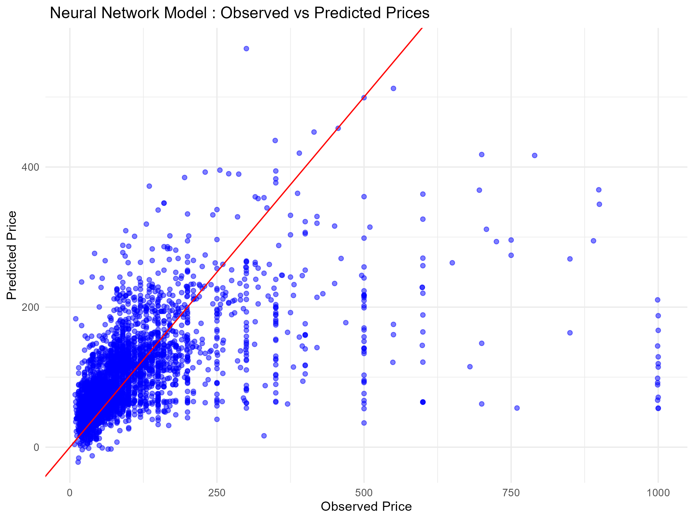

```{r download packages, include = FALSE}
options(repos = c(CRAN = "https://cran.rstudio.com/"))
#file.edit("~/.Rprofile")
```

```{r setup!, include=FALSE}
knitr::opts_chunk$set(echo = TRUE, 
                      warning = FALSE, message = FALSE)
# options(repos = c(CRAN = "https://cran.rstudio.com/"))
```

```{r pressure., echo=FALSE, warning=FALSE, out.width='60%', fig.align='center', fig.cap="Barcelona's Digital Landscape: a data-driven exploration of urban dynamics around Sagrada Familia. AI-generated by our team."}

```

```{r Packages, include=FALSE}
# Instal requiered packages
#install.packages(c("dplyr", "ggplot2", "tidyr", "RColorBrewer", "leaflet", "shiny", "leaflet.extras", "corrplot", "treemap", "wordcloud", "mgcv", "gratia", "rsample", "Metrics", "forcats", "VGAM", "e1071", "NeuralNetTools", "car"))
```

```{r libraries, include=FALSE}
# Load required libraries
library(dplyr)        # Data manipulation and wrangling
library(ggplot2)      # Data visualization
library(tidyr)        # Data tidying
library(RColorBrewer) # Color palettes for visualizations
library(leaflet)      # Interactive maps
library(shiny)        # Building interactive web applications
library(leaflet.extras) # Additional features for leaflet maps
library(corrplot)     # Visualization of correlation matrices
library(mice)         # Handling missing data
library(nnet)         # Multinomial regression model
library(forcats)      # Handling categorical variables
library(patchwork)    # Combining multiple ggplots
library(VGAM)         # Multinomial logistic regression models
library(tidyverse)    # Collection of data science packages
library(e1071)        # Support Vector Machines (SVM)
library(reshape2)     # Data reshaping for ggplot visualizations
library(caret)        # Machine learning and model evaluation
library(wordcloud)    # Wordcloud plot
library(rsample)      # Split dataset into training and testing
library(mgcv)         # Gam Mdels
library(neuralnet)    # Neural Netwotk
library(NeuralNetTools) # Plot Neural network
library(caret)        # confusion matrix
library(car)
library(neuralnet)
library(NeuralNetTools)  # For plotnet
```

# 1. Introduction

## 1.1 Presentation of the case

A tourism company based in Zürich, Switzerland, has observed a significant increase in travel demand to Barcelona in recent years. Indeed, Barcelona ranks as the third most in-demand city for Airbnb rentals in Europe, behind Paris and London.

Consequently, the company’s manager has requested a Machine Learning study and analysis of Airbnb accommodations in the city. The goal is to understand price behavior and identify the factors influencing accommodation costs and occupancy, enabling the company to provide optimal responses to clients' inquiries.

To achieve this goal, the team has decided to analyse and address three question to provide comprehensive insights for the manager.

1. **What are the key factors influencing accommodation prices in Barcelona?**
2. **Can we predict occupancy rates based on location, amenities, or other factors?**
3. **How accurately can machine learning predict Airbnb prices in Barcelona? Which models perform best for this dataset?**

## 1.2 Motivations
Barcelona is one of the most visited cities in Europe, and the rise of Airbnb and other short-term rental platforms has led to a notable increase in tourism. However, this growth also presents challenges for accommodation businesses and the local housing market. A study conducted by the Social Science Research Network (<span style="color:blue">SSRN, link: https://papers.ssrn.com/sol3/papers.cfm?abstract_id=3428237</span>) revealed that rental costs in neighborhoods with high Airbnb activity increased by 7% between 2009 and 2016. This is primarily due to the fact that property owners, motivated by the demand from tourists seeking short-term rentals, frequently opt to lease their properties at higher rates during the short term rather than committing to long-term leases.

For these reasons, it is crucial for tourism companies to understand this dynamic market to remain competitive and provide tailored services to their clients.

The Zürich-based tourism company needs reliable data on Airbnb prices and occupancy rates to make data-driven recommendations and stay ahead of competitors.

## 1.3 Disclaimer
This analysis is for educational purposes only. The findings are based on public data and are not professional advice. The results should not be used for business or policy decisions.

## 1.4 Dataset selected

To conduct the study, the team has decided to analyse a dataset of Barcelona Airbnbs available on the Kaggle website (<span style="color:blue">link: https://www.kaggle.com/datasets/fermatsavant/airbnb-dataset-of-barcelona-city</span>)

The dataset consists of 19.833 observations across 25 variables, including geographical zones, amenities, prices, and accommodations.

```{r dataset download, include=FALSE}
# import the dataset
BCN_Accomm_full <- read.csv("Cleaned_airbnb_barcelona.csv")
```

Below, we can see the structure of the dataset, and the names and data types for each column.

```{r Structure dataset, echo = FALSE}
# Structure
glimpse(BCN_Accomm_full)
```

### Numerical values:
- **`X`**: numerical index for rows
- **`id`**: unique identifier for listings
- **`host_id`**: unique identifier for hosts
- **`host_listings_count`**: number of listings by the host
- **`latitude`**: geographic latitude of the listing
- **`longitude`**: geographic longitude of the listing
- **`accommodates`**: number of guests the listing can accommodate
- **`bathrooms`**: number of bathrooms in the listing
- **`bedrooms`**: number of bedrooms in the listing
- **`beds`**: number of beds in the listing
- **`minimum_nights`**: minimum number of nights required for booking
- **`availability_30`**: number of available nights in the next 30 days
- **`availability_60`**: number of available nights in the next 60 days
- **`availability_90`**: number of available nights in the next 90 days
- **`availability_365`**: number of available nights in the next 365 days
- **`number_of_reviews_ltm`**: number of reviews in the last 12 months
- **`review_scores_rating`**: average review rating score

### Binary variables:
- **`host_is_superhost`**: indicates if the host is a superhost (`"t"` or `"f"`)
- **`has_availability`**: indicates if the listing is available for booking (`"t"` or `"f"`)

### String values:
- **`neighbourhood`**: name of the neighbourhood where the listing is located
- **`zipcode`**: postal code of the listing
- **`property_type`**: type of property (e.g., "Apartment")
- **`room_type`**: type of room (e.g., "Entire home/apt")
- **`amenities`**: list of amenities provided in the listing
- **`price`**: price of the listing as a string (e.g., "$130.00")

As can be appreciated, the variable 'price' has a 'Character' data type. Therefore, in the chapter 3, this field will be transformed into an integer variable to enable the necessary calculations.

## 1.5 Sub-sampling

In order to streamline the calculations and analysis, a sub-dataset will be created in the following steps, considering 10.000 observations randomly selected. Additionally, a seed is created to ensure the same observations are maintained throughout the analysis

```{r sub-set, include=FALSE}
set.seed(100)
BCN_Accomm_sub <- sample_n(BCN_Accomm_full, 10000) 
glimpse(BCN_Accomm_sub)
```

# 2. Methodology

To address the research question, the study will be divided into three parts. First, an Exploratory Data Analysis (EDA) will be conducted to gain a deeper understanding of the data. Second, Machine Learning models will be implemented, and their performance will be evaluated to identify the best-performing model. Finally, the selected model will be used to provide the most accurate answer to the research question posed by the team.

The different models to be developed are: 

1. Linear Models
2. Generalised Linear Models with family set to Poisson for binary data
3. Generalised Linear Models for multinomial data
4. Generalised Additive Models
5. Neural Network
6. Support Vector Machine

# 3 Exploratory Data Analysis

## 3.1 Converting Price variable to numeric

First, the pricing variable will be converted into a numeric format, and in the fifth chapter of this report (Machine Learning Models), the categorical variables will be transformed into factors for further analysis and modeling.

```{r Convert price to numeric, include=FALSE}
BCN_Accomm_sub$price <- gsub(",", "", BCN_Accomm_sub$price) # removed ','
BCN_Accomm_sub$price <- gsub("\\$", "", BCN_Accomm_sub$price) # removed '$' sign
BCN_Accomm_sub$price <- as.numeric(BCN_Accomm_sub$price)  # converted to number format
```

## 3.2 Missing values (detect and treat) 

We inspect the dataset to have idea about possible missing values, their amount and their distribution.

```{r miss-values, include=FALSE}
print('Location of missing values')
# find location of missing values column wise
miss_values <- sapply(BCN_Accomm_sub, function(x) which(is.na(x)))
print(miss_values)
```

```{r Count missing values per columns, echo=FALSE}
# count the missing values column wise
miss_values_col <- sapply(BCN_Accomm_sub, function(x) sum(is.na(x)))
print(miss_values_col)
```

```{r patt-miss-values, echo = FALSE}
md.pattern(BCN_Accomm_sub, rotate.names = TRUE)
```

```{r tab-miss-values, echo = FALSE}
# Total observations
total_rows <- nrow(BCN_Accomm_sub) 

# Calculate missing values (count and percentage)
missing_values <- data.frame(
  #Variable = names(BCN_Accomm_full),
  Missing_Count = colSums(is.na(BCN_Accomm_sub)),
  Missing_Percent = paste0(round((colSums(is.na(BCN_Accomm_sub)) / total_rows) * 100, 2), "%"))

# Order DataFrame table in descending order
missing_values <- missing_values[order(-missing_values$Missing_Count), ]

# Display the table
knitr::kable(missing_values, 
             caption = "Missing Values by Variable",
             align = "c")
```

### 3.2.1 How to manage Missing values for each field (MD) 

host_listings_count : since is not possible to make any calculation on the number of listing of the host, we exclude the 22 rows that lack of it.
bathrooms : the number of bathrooms is missing in 6 rows. 
beds : the number of beds is not specified for 18 assets. 
bedrooms : 2 rows contains missing value and can be deleted.
review_scores_rating : the review score rating is missing in 2415 rows of 10000. It's a quite relevant percentage, around the 24% of the data we selected. In this case we decide to impute the missing values replacing it with the value 0.

```{r imputation_review_score_rating, include = FALSE}
# Create a new data frame with the imputed review_scores_rating column
imp_BCN_Accomm_sub <- BCN_Accomm_sub %>%
  mutate(review_scores_rating = if_else(is.na(review_scores_rating), 0, review_scores_rating))

md.pattern(imp_BCN_Accomm_sub, rotate.names = TRUE)
```

Eventually, the other fields that present missing values do not allow to replace the empty data with estimates (average, mean, ...) so called imputation. This fields include in total 48 assets that represent 0.48% of the total assets and allows to delete the entire rows without loosing too much information.

```{r removing-rows, include = FALSE}
BCN_Accomm <- na.omit(imp_BCN_Accomm_sub) # from this point we'll use this data set
md.pattern(BCN_Accomm, rotate.names = TRUE)
```

## 3.3 Correlation matrix

```{r correlation_matrix_numeric_fields, echo = FALSE}
# Create a correlation matrix for numeric fields
cor_BNC_Accomm <- select_if(BCN_Accomm, is.numeric) %>%
  select(-c(id, X, host_id))

# make a data frame
cor_BNC_Accomm <- data.frame(cor_BNC_Accomm)
str(cor_BNC_Accomm)

# print correlation matrix
corrplot(cor(cor_BNC_Accomm), type = "upper", order = "hclust", tl.col = "black")
```

From the correlation matrix is possible to deduct the following characteristics:
- there's almost no correlation between availability periods and number of beds, bedrooms, bathrooms. It would suggest that the availability of the house do not depend from those features, rather probably from the location and facilities.
- there is a positive correlation between number of bedrooms, beds and bathrooms.
- there is a positive correlation between the availability periods. 

## 3.4 Outliers (boxplots) (detect and treat)
Since the price variable is a key focus of our analysis, an outlier analysis of this variable has been conducted.

### 3.4.1 Count of outliers in Price

```{r Outliers for the variable Price, include = FALSE}
# Calculate Q1, Q3, and IQR for the price variable
Q1 <- quantile(BCN_Accomm$price, 0.25)
Q3 <- quantile(BCN_Accomm$price, 0.75)
IQR <- Q3 - Q1

# Add a column to indicate outliers 
BCN_Accomm_sub_outlier <- BCN_Accomm %>%
  mutate(is_outlier = price < (Q1 - 1.5 * IQR) | price > (Q3 + 1.5 * IQR))

# Count the number of outliers
outliers_count <- sum(BCN_Accomm_sub_outlier$is_outlier)

# Display outliers count
outliers_count

```

Out of a total of 10,000 values, 804 (8.04%) are identified as outliers. Below, a boxplot is presented to visualize the median and the outlier observations.

```{r Boxplot Price, echo = FALSE}
# Boxplot for price variable
boxplot(BCN_Accomm$price, 
        horizontal = TRUE,
        axes = FALSE, 
        staplewex = 1, 
        ylim = c(2, 500),
        main = "Boxplot of Price/Night Variable (€)")  

# X Axis
axis(1, las = 1)

# Add text labels values (Q1, Q3, IQR)
stats <- boxplot.stats(BCN_Accomm$price)$stats
text(x = stats, y = 1.25, labels = stats, pos = 3, cex = 0.9) 
```

From the boxplot above, it can be concluded that the median price is approximately 65€ per night, with 50% of the observations concentrated between 40€ (25th percentile) and 112€ (75th percentile), representing the interquartile range (IQR).

Additionally, the presence of numerous outliers extending to the right indicates a right-skewed distribution, meaning higher prices are influencing the dataset.

The significant number of observations with higher prices could suggest the presence of many luxury properties. Therefore, further analysis is required to identify the factors influencing these price variations.

### 3.4.2 Detecting Top 20 Price Outliers

```{r Filter outliers, echo = FALSE}
# Filter rows Outliers
outlier_extremes <- BCN_Accomm_sub_outlier%>%
  filter(is_outlier == TRUE) %>%
  select(neighbourhood, property_type, bedrooms, price) %>%
  arrange(desc(price), neighbourhood, property_type) %>%
  slice_head(n = 20)  # Select top 20 Outliers for price

# Display Prices outliers
knitr::kable(outlier_extremes, 
             caption = "Table 2: Top 20 and Outliers for Price Variable with Neighbourhood",
             align = "c")
```

It seems that the price variable may contain erroneous entries. For further analysis, research revealed that the average nightly rate for an Airbnb in Barcelona is €93 (according to <span style="color:blue">Hostel Geeks, link: https://hostelgeeks.com/best-airbnbs-in-barcelona-spain/</span>). Therefore, prices of €8,000 are likely errors. As a result, it was decided to exclude prices above €1,000 from the analysis.

The new summary for tha Price variable is the following:

```{r Filter price lesss than 1000, echo=FALSE}
# Filter dataset
BCN_Accomm <- BCN_Accomm %>%
  filter(price <= 1000)
summary(BCN_Accomm$price)
```

Now, a new Correlation Matrix with the filtered observations of the price variable is displayed.

```{r New correlation_matrix_numeric_fields, echo = FALSE}
# Create a correlation matrix for numeric fields
cor_BNC_Accomm_new <- select_if(BCN_Accomm, is.numeric) %>%
  select(-c(id, X, host_id))

# make a data frame
cor_BNC_Accomm_new <- data.frame(cor_BNC_Accomm_new)
str(cor_BNC_Accomm)

# print correlation matrix
corrplot(cor(cor_BNC_Accomm_new), type = "upper", order = "hclust", tl.col = "black")
```

We can observe that the price variable is now most correlated with variables related to the size and capacity of an Airbnb, such as bathrooms, bedrooms, number of beds, and accommodates.

On the other hand, general availability and review scores have little impact on the price.

## 3.5 Variables inspection

### 3.5.1 Histograms for Numerical Variables

```{r Histograms Numerical Variables, echo=FALSE}

# Reshape the data set to long format
BCN_Accomm_hist <- BCN_Accomm %>%
  pivot_longer(cols = c(price,
                        accommodates,
                        bathrooms,
                        bedrooms,
                        beds,
                        minimum_nights,
                        number_of_reviews_ltm,
                        review_scores_rating
),  
               names_to = "variable", values_to = "value")

# Create histograms with facet_wrap
hist_num <- ggplot(BCN_Accomm_hist, aes(x = value)) +
  geom_histogram(bins = 30, fill = "skyblue", color = "black") +  
  labs(title = "Histograms for Numerical Variables", x = "Value", y = "Frequency") +
  facet_wrap(~variable, scales = "free") +  # each plot with their own y axes
  theme_minimal()

print(hist_num)
```

From the histograms above, several variables exhibit right-skewed distributions, including price, minimum_nights, and number_of_reviews_ltm.

On the other hand, the data suggests that in Barcelona, Airbnb listings are primarily designed for small groups of people seeking short-term stays. Additionally, these accommodations tend to receive high review scores, indicating good guest satisfaction with the different properties.

### 3.5.2 Pie Charts for Binary Variable "Host_is_superhost"

```{r Superhost Status, echo=FALSE}
# Calculate percentages and relabel values
superhost_data <- BCN_Accomm %>%
  count(host_is_superhost) %>%
  mutate(
    percentage = n / sum(n) * 100,  # Calculate percentages
    host_is_superhost = case_when(
      host_is_superhost == "f" ~ "False",  # Replace 'f' with 'False'
      host_is_superhost == "t" ~ "True",   # Replace 't' with 'True'
      TRUE ~ host_is_superhost             # Retain original if no condition is met
    )
  )

# Create the pie chart with percentages
pc_sh_status <- ggplot(superhost_data, aes(x = "", y = n, fill = host_is_superhost)) +
  geom_col() +
  coord_polar(theta = "y") +
  geom_text(aes(label = paste0(round(percentage, 1), "%")), position = position_stack(vjust = 0.5)) +  # Add percentages
  labs(
    title = "Proportion of Superhost Status",
    fill = "Superhost Status\n(False = Not a Superhost, True = Superhost)"
  ) +
  theme_void() +
  theme(
    plot.title = element_text(hjust = 0.5, face = "bold"),  # Center and bold title
    legend.title = element_text(size = 10),
    legend.text = element_text(size = 9)
  )

print(pc_sh_status)
```

Almost 19% of the hosts offering an Airbnb in Barcelona are not categorized as Superhosts. This means tourists can find accommodations in the city where hosts go above and beyond to provide excellent hospitality. This insight could be a key factor in explaining the higher price values observed in certain neighborhoods.

### 3.5.3 Plots for String Variables

This section presents a variety of plots for the categorical variables, including Property Type, Room Type, Top Neighbourhoods, and Amenities.

```{r Top 10 property types, echo=FALSE, message=FALSE, warning=FALSE}
# Filter for the top 10 property types and calculate percentages
top_property_types <- BCN_Accomm %>%
  count(property_type, sort = TRUE) %>%
  slice_max(n, n = 10) %>%  # Keep the top 10 most frequent property types
  mutate(percentage = n / sum(n) * 100)  # Calculate percentages

# Create the bar plot with percentages and labels
top_property <- ggplot(top_property_types, aes(x = reorder(property_type, percentage), y = percentage, fill = property_type)) +
  geom_col() +
  geom_text(aes(label = paste0(round(percentage, 1))), hjust = -0.2, size = 4) +  # Add percentage labels
  coord_flip() +  # Flip coordinates for better readability
  labs(title = "Top 10 Property Types by Percentage", x = "Property Type", y = "Percentage (%)") +
  theme_minimal() +
  theme(
    legend.position = "none",
    plot.title = element_text(hjust = 0.5, face = "bold"))  # Center and bold title)

print(top_property)
```

From the plot above, it can be observed that apartments dominate the Airbnb market in Barcelona, accounting for 86% of the listings.

On the other hand, the low availability of luxury or specialized accommodations, such as Boutique Hotels (0.5%), Guest Suites (0.7%), and Lofts (2.4%), suggests that these property types cater to a niche market. Travelers opting for these accommodations are likely visiting Barcelona for specific reasons, such as work or unique travel experiences.

```{r Barplots Room Type, echo=FALSE, message=FALSE, warning=FALSE}
# Reshape the dataset to long format 
BCN_Accomm_long <- BCN_Accomm %>%
  pivot_longer(cols = c(room_type), names_to = "variable", values_to = "value")

# Calculate the percentage for each category within the room_type variable
BCN_Accomm_percentage <- BCN_Accomm_long %>%
  group_by(variable, value) %>%
  summarize(count = n()) %>%
  mutate(percentage = count / sum(count) * 100)

# Create a barplot
room_type_plot <- ggplot(BCN_Accomm_percentage, aes(x = value, y = percentage, fill = variable)) +
  geom_bar(stat = "identity") + 
  labs(title = "Percentage Barplot for Room Type", x = "Category", y = "Percentage (%)") +
  theme_minimal() + 
  theme(
    legend.position = "none",
    plot.title = element_text(hjust = 0.5, face = "bold"))

print(room_type_plot)
```

The majority of Room Type are split between Entire home/Apartment and Private Room.

Less than 1% of the hosts offer Shared Room, which suggests that travelers prefer more privacy during the stay.

```{r Top 10 Neighbourhoods, echo=FALSE, message=FALSE, warning=FALSE}
# Filter for the top 10 neighbourhoods and calculate percentages
top_neighbourhoods <- BCN_Accomm %>%
  count(neighbourhood, sort = TRUE) %>%
  slice_max(n, n = 10) %>%
  mutate(percentage = n / sum(n) * 100)  # Calculate percentages

# Create the plot with percentages and labels
top_neighbourhoods <- ggplot(top_neighbourhoods, aes(x = reorder(neighbourhood, percentage), y = percentage, fill = neighbourhood)) +
  geom_col() +
  geom_text(aes(label = paste0(round(percentage, 1))), hjust = -0.2, size = 4) +  # Add percentage labels
  coord_flip() +
  labs(title = "Top 10 Neighbourhoods by Percentage", x = "Neighbourhood", y = "Percentage (%)") +
  theme_minimal() +
  theme(
    legend.position = "none",
    plot.title = element_text(hjust = 0.5, face = "bold"))

print(top_neighbourhoods)
```

The Eixample district of Barcelona represents the most popular neighbourhood on Airbnb, with 27% of the total listings. This is followed by Ciutat Vella, which accounts for 18.8% of the listings.

Eixample is situated in close proximity to the historic centre of the city and is more centrally located in comparison to other neighbourhoods. The area offers many attractions for tourists, including La Sagrada Familia, Casa Batlló, and Passeig de Gràcia. In addition to its excellent transport connections, Eixample is an ideal destination for visitors. 

On the other hand, Ciutat Vella is the oldest part of Barcelona and serves as the heart of the city, known for its historical charm and vibrant cultural scene. 

Given this, the Tourism Company in Zürich could recommend that its clients focus on these neighbourhoods to attract more customers and enhance their travel experience.

### 3.5.4 Worldcloud for Amaneties

```{r Wordcloud for amanities, echo=FALSE}
# Combine all amenities into a single text string and clean it
amenities_text <- BCN_Accomm$amenities %>%
  paste(collapse = " ") %>%                # Combine all rows into one string
  gsub("\\[|\\]|'", "", .)                 # Remove brackets and quotes from the field

# Split the text into words and calculate word frequencies
word_freq <- table(unlist(strsplit(amenities_text, ", ")))

# Create the word cloud
wordcloud(words = names(word_freq), 
          freq = as.numeric(word_freq), 
          min.freq = 10,                   # Minimum frequency for words to appear
          scale = c(3, 0.5),               # Word size scale
          random.order = FALSE,            # Words ordered by frequency
          colors = brewer.pal(8, "Dark2"))
```

The Wordcloud above, provides the most common amenities offered by the different hosts. 

The most prominent amenities are: Kitchen, Wifi, Heating, Washer and Hair dryer. his can be taken to indicate that tourists may consider a place to be comfortable for their stay if it meets these basic requirements.

## 3.6 Summary Statistics


```{r numeric variables , echo=FALSE, results='hide'}
# Overall Summary: High level statistical overview of all numericvariables in the dataset.

#Concise statistical summary of all the numeric variables:
# Filter numeric variables manually
numeric_variables <- BCN_Accomm %>%
  select_if(is.numeric)  

# Display the summary directly
summary(numeric_variables)
```

```{r summary-large table numeric-variables, echo= FALSE, results='hide'}
# Filter numeric variables
numeric_variables <- BCN_Accomm %>%
  select_if(is.numeric) 

# Calculate descriptive statistics for each numeric variable
numeric_summary <- data.frame(
  Min = round(sapply(numeric_variables, min, na.rm = TRUE), 2),
  `1st Qu.` = round(sapply(numeric_variables, quantile, probs = 0.25, na.rm = TRUE), 2),
  Median = round(sapply(numeric_variables, median, na.rm = TRUE), 2),
  Mean = round(sapply(numeric_variables, mean, na.rm = TRUE), 2),
  `3rd Qu.` = round(sapply(numeric_variables, quantile, probs = 0.75, na.rm = TRUE), 2),
  Max = round(sapply(numeric_variables, max, na.rm = TRUE), 2)
)
# Transpose the table to display variables as rows
numeric_summary <- (numeric_summary)

# Display the table in the report
knitr::kable(numeric_summary, 
             caption = "Summary Statistics for Numeric Variables", 
             align = "c")
```

```{r summary-related to pricing variables, echo=FALSE, results='hide'}
# Filter relevant columns for objective
# 1. Variables to analyze price
  
price_variables <- BCN_Accomm %>%
  dplyr::select(accommodates, bathrooms, bedrooms, beds, 
                price, review_scores_rating, number_of_reviews_ltm)
# Calculate descriptive statistics
# For analyzing price
price_stats <- data.frame(
  Mean = round(sapply(price_variables, mean, na.rm = TRUE), 2),
  Median = round(sapply(price_variables, median, na.rm = TRUE), 2),
  Standard_Deviation = round(sapply(price_variables, sd, na.rm = TRUE), 2),
  Min = round(sapply(price_variables, min, na.rm = TRUE), 2),
  Max = round(sapply(price_variables, max, na.rm = TRUE), 2)
)
# Transpose the tables to display variables as columns
price_stats <- (price_stats)

# Display the table in the report
knitr::kable(price_stats, 
             caption = "Summary Statistics for Variables Related to Price", 
             align = "c")
```

```{r summary-related to availability, echo=FALSE, results='hide'}
# 2. Variables related availability
availability_variables <- BCN_Accomm %>%
  dplyr::select(minimum_nights, availability_30, availability_60, 
                availability_90, availability_365)


# Calculate descriptive statistics
# For analyzing availability
availability_stats <- data.frame(
  Mean = round(sapply(availability_variables, mean, na.rm = TRUE), 2),
  Median = round(sapply(availability_variables, median, na.rm = TRUE), 2),
  Standard_Deviation = round(sapply(availability_variables, sd, na.rm = TRUE), 2),
  Min = round(sapply(availability_variables, min, na.rm = TRUE), 2),
  Max = round(sapply(availability_variables, max, na.rm = TRUE), 2)
)

# Transpose the tables to display variables as columns
availability_stats <- (availability_stats)

# Display the table in the report
knitr::kable(availability_stats, 
             caption = "Summary Statistics for Variables Related to Availability", 
             align = "c")
```

```{r summary categorical variables, echo=FALSE, results='hide'}
#Summary Statistics for Categorical Variables

# Select the most relevant categorical variables
categorical_variables <- BCN_Accomm %>%
  dplyr::select(host_is_superhost, neighbourhood, zipcode, property_type, room_type, has_availability)

# Calculate frequency and relative frequency
categorical_summary <- lapply(categorical_variables, function(var) {
  freq <- table(var)  # Absolute frequency
  rel_freq <- prop.table(freq) * 100  # Relative frequency
  data <- data.frame(
    Category = names(freq),
    Frequency = as.vector(freq),
    Percentage = round(as.vector(rel_freq), 2)
  )
   data <- data[order(-data$Frequency), ]  # Ensure sorting by frequency
  data <- head(data, 20)  # Keep only the top 20 categories
  data  # Return the top 20 sorted rows
})

# Display results in the report for each categorical variable
for (var_name in names(categorical_summary)) {
  cat("\n### Variable:", var_name, "\n\n")
  print(knitr::kable(
    categorical_summary[[var_name]],
    caption = paste("Summary for", var_name, "(Ordered by Frequency)"),
    align = "c"
  ))
}
```

# 4 Visualization Insights

This section was designed to allow the employees of the Tourism Company and other Users to interact with the data on neighborhoods, prices, and reviews.

## 4.1 Airbnb locations by neighbourhood with Interactive panel 

The purpose of the following interactive plot is to allow users to select a neighborhood of interest and visualize, on a map, the different accommodations available along with their price per night when one of the circles is clicked.

```{r  Airbnb locations, echo = FALSE}
# Replace "BCN_Accomm" with your actual data frame
filtered_data <- BCN_Accomm

# Create an interactive map
leaflet(data = filtered_data) %>%
  addTiles() %>%  # Add OpenStreetMap tiles
  setView(lng = 2.154007, lat = 41.390205, zoom = 12) %>%  # Center the map in Barcelona
  addCircleMarkers(
    lng = ~longitude,  
    lat = ~latitude,   
    color = "blue",    
    radius = 5,        
    popup = ~paste(
      "<b>Price:</b> €", price, "<br>",
      "<b>Room Type:</b>", room_type, "<br>",
      "<b>Neighbourhood:</b>", neighbourhood
    )  # Popup content
  )
```

## 4.2 Heatmap of prices

In the heatmap below, users can observe the zones with higher accommodation prices (red/orange areas).

In contrast, the zones colored in green or blue represent lower-priced neighborhoods.

According to the heatmap, the Tourism Company can recommend the red zones to tourists looking for more centralized accommodations, regardless of price. On the other hand, tourists who want to save money can be advised to choose accommodations in the green or blue areas, which are typically farther from the city center.

```{r Heatmap of prices, echo = FALSE}
# Mean price per neighbourhood 
neighborhood_means <- BCN_Accomm %>%
    group_by(neighbourhood) %>%
    summarize(mean_price = mean(price, na.rm = TRUE),
              latitude = mean(latitude, na.rm = TRUE),
              longitude = mean(longitude, na.rm = TRUE))
# Create Map

leaflet(data = BCN_Accomm) %>%
    addProviderTiles("CartoDB.Positron") %>%  
    addHeatmap(
        lng = ~longitude,
        lat = ~latitude,
        intensity = ~price,
        blur = 25,       
        max = 0.03,          
        radius = 15    
    ) %>%
    addMarkers(
        data = neighborhood_means,
        ~longitude, ~latitude,
        popup = ~paste(
            "<strong>Neighborhood:</strong>", neighbourhood,
            "<br><strong>Mean Price (€):</strong>", round(mean_price, 2)
        )
    ) %>%
    addLegend(
        "bottomright",
        pal = colorNumeric("viridis", BCN_Accomm$price),
        values = BCN_Accomm$price,
        title = "Price (€)",
        opacity = 0.7
    )

```

## 4.3 Review Score Rating vs. Price by Room Type

```{r Review Score Rating vs. Price by Room Type, echo = FALSE, warning=FALSE}
#display.brewer.all() #Visualize color palette
ggplot(BCN_Accomm, aes(x = review_scores_rating, y = price, color = room_type)) +
  geom_point(alpha = 0.6) + 
  #scale_color_brewer(palette = "Set2") +
  labs(title = "Scatter Plot of Review Score Rating vs. Price by Room Type",
       x = "Review Score Rating",
       y = "Price",
       color = "Room Type") + 
  theme_minimal()

```

From the plot above, the following insights can be derived:
- The majority of listings are concentrated at the lower price range (below 250 Euros), irrespective of room type.
- Accommodations with high review scores (exceeding 90 points) are distributed across all price categories, indicating that well-reviewed Airbnbs are not restricted to a particular room type or price range.

# 5 Machine Learning Models

## 5.1 Variables treatment

In this chapter, different machine learning models will be explored to predict Airbnb prices and the occupancy rate over the next 30 days.

The formula to calculate the Occupancy rate in 30 days is:

**Occupancy Rate**:
$$
\text{Occupancy Rate} = \left(1 - \frac{\text{Availability 30 Days}}{\text{Total Days = 30}}\right) \times 100
$$

According to the formula above, a new columns with the Occupancy rate is calculated and the head data of the new variable Occupancy_rate_30 is:

```{r New column for Occupancy rate, echo = FALSE}
# Create a new column for occupancy rate
BCN_Accomm$occupancy_rate_30 <- (1 - BCN_Accomm$availability_30 / 30) * 100

# Preview the new column
head(BCN_Accomm$occupancy_rate_30)
class(BCN_Accomm$occupancy_rate_30)
```

With this new predictor, the occupancy rate in the next 30 days is going to be predicted.

As mentioned in the previous chapters, the categorical variables are converted into factors to proceed with the modeling phase. These are: neighbourhood, property_type, room_type, availability_30, zipcode.
Moreover, variables that represent counts or continuous numbers are converted into numeric: accommodates, bathrooms, bedrooms, beds, latitude, longitude, review_scores_rating and minimum_nights.

```{r Covert categorical variables into factors, echo = FALSE}
# Remove rows with the unwanted neighborhoods
BCN_Accomm <- BCN_Accomm[!(BCN_Accomm$neighbourhood %in% c("La Vall d'Hebron", "Torre Baró")), ]

# converting categorical variables into factors
BCN_Accomm$neighbourhood <- as.factor(BCN_Accomm$neighbourhood)
BCN_Accomm$property_type <- as.factor(BCN_Accomm$property_type)
BCN_Accomm$room_type <- as.factor(BCN_Accomm$room_type)
BCN_Accomm$availability_30 <- as.factor(BCN_Accomm$availability_30)
BCN_Accomm$zipcode <- ifelse(grepl("^[0-9]{4}$", BCN_Accomm$zipcode), # Check if zipcode is exactly 4 digits
                             BCN_Accomm$zipcode, # Keep valid zipcodes
                             "unknown")
BCN_Accomm$zipcode <- as.factor(BCN_Accomm$zipcode)

# Convert variables that represent counts or continuous numbers into numeric
# If these were read as characters or factors, ensure they're numeric:
if (is.factor(BCN_Accomm$accommodates)) {
  BCN_Accomm$accommodates <- as.numeric(as.character(BCN_Accomm$accommodates))
}
if (is.factor(BCN_Accomm$bathrooms)) {
  BCN_Accomm$bathrooms <- as.numeric(as.character(BCN_Accomm$bathrooms))
}
if (!is.numeric(BCN_Accomm$bedrooms)) {
  BCN_Accomm$bedrooms <- as.numeric(BCN_Accomm$bedrooms)
}
if (!is.numeric(BCN_Accomm$beds)) {
  BCN_Accomm$beds <- as.numeric(BCN_Accomm$beds)
}
if (!is.numeric(BCN_Accomm$latitude)) {
  BCN_Accomm$latitude <- as.numeric(BCN_Accomm$latitude)
}
if (!is.numeric(BCN_Accomm$longitude)) {
  BCN_Accomm$longitude <- as.numeric(BCN_Accomm$longitude)
}
if (!is.numeric(BCN_Accomm$review_scores_rating)) {
  BCN_Accomm$review_scores_rating <- as.numeric(BCN_Accomm$review_scores_rating)
}
if (!is.numeric(BCN_Accomm$minimum_nights)) {
  BCN_Accomm$minimum_nights <- as.numeric(BCN_Accomm$minimum_nights)
}
```

## 5.2 Train and Test data

Before analysing the different models, we need to divide the data into a training set and test set.
The first set will be used to find the relationship between dependent and independent variable, while the second set will be used to analyse the performance of the models. 
We decide to use 60% of the data set as a training set, and the rest as a test set. We also remove rows with NAs values in the test set to avoid problems in the evaluation of models' prediction.

```{r Train and Test split, echo =TRUE}
set.seed(1000)
# Define the number of groups and the amount of sample for each
group <- sample(2, nrow(BCN_Accomm),
                replace = TRUE,
                prob = c(0.6, 0.4))

# training data set with around 60% of the samples
train <- BCN_Accomm[group==1,]

# test data set with around 40% of the samples
test <- BCN_Accomm[group==2,]
test <- na.omit(test) # removing rows with NAs values might reduce the size of the test set

```

Moreover, we assure that all factor variables have the same levels in the train and test sets, including a final check to assure that no NAs values are present as concerns numerical variables.

```{r, include = FALSE}
str(BCN_Accomm)
# For all factor variables used in the model, ensure that the test factors have the same levels as train
identical(levels(test$occupancy_rate_30), levels(train$occupancy_rate_30))
identical(levels(test$property_type), levels(train$property_type))
identical(levels(test$room_type), levels(train$room_type))
identical(levels(test$neighbourhood), levels(train$neighbourhood))
identical(levels(test$zipcode), levels(train$zipcode))
identical(levels(test$availability_30), levels(train$availability_30))
```

```{r, include =FALSE}
# Ensure no NAs or infinite values in important numeric variables
numeric_vars <- c("bathrooms", "bedrooms", "accommodates", "beds", 
                  "latitude", "longitude", "review_scores_rating", "minimum_nights", "price", "occupancy_rate_30")
sapply(numeric_vars, function(var) anyNA(train[[var]]))
sapply(numeric_vars, function(var) anyNA(test[[var]]))
```

At this point, we prepare also the train and test sets in a normalized version that will be used in some of the models, naming them respectively train_normalized and test_normalized.

```{r normalized-numeric, include = FALSE}
# Numeric variables to normalize
numeric_columns <- c("bathrooms", "bedrooms", "accommodates", "beds",
                     "latitude", "longitude", "review_scores_rating", "minimum_nights", "price")

# Normalize train data (already done)
normalize <- function(x) {
  (x - min(x)) / (max(x) - min(x))
}
train_normalized <- train
train_normalized[, numeric_columns] <- lapply(train[, numeric_columns], normalize)

# Normalize test data (use train data's min and max for normalization)
test_normalized <- test
test_normalized[, numeric_columns] <- lapply(numeric_columns, function(col) {
  (test[[col]] - min(train[[col]])) / (max(train[[col]]) - min(train[[col]]))
})

str(train_normalized)
str(test_normalized)
```

As regards the categorical variable neighborhood, for some of the models, it needs to be encoded into numerical values. We apply a one-hot encoding so that each unique neighborhood will become a separate binary feature.

```{r hot-encoding, include = FALSE}
# One-hot encode 'neighbourhood' in train data for SVM (without including the reference level)
train_neigh_dummies <- model.matrix(~neighbourhood - 1, data=train_normalized)

# Combine the dummy variables with the train data
train_normalized_encod <- cbind(train_normalized, train_neigh_dummies)

# Remove the original 'neighbourhood' column (since it's now one-hot encoded)
train_normalized_encod$neighbourhood <- NULL

# One-hot encode 'neighbourhood' in test data for SVM (use the same levels as in the train data)
test_neigh_dummies <- model.matrix(~neighbourhood - 1, data=test_normalized)

# Ensure test_normalized has the same dummy variables as train_normalized

# Select the columns of the test data to match the train data's one-hot encoded columns
test_neigh_dummies <- test_neigh_dummies[, colnames(train_neigh_dummies), drop = FALSE]

# Combine the dummy variables with the test data
test_normalized_encod <- cbind(test_normalized, test_neigh_dummies)

# Remove the original 'neighborhood' column from test data
test_normalized_encod$neighbourhood <- NULL
```

**Variables for Pricing Model**

Next, based on the Correlation Matrix, showed in chapter 3.4, the variables used to address the first research question about price, are:

- **`bedrooms`**
- **`bathrooms`**
- **`accommodates`**
- **`beds`**
- **`latitude'** and **'longitude`**
- **`review_score_rating`**
- **`minimum_nights`**
- **`property_type`**
- **`room_type`**
- **`neighbourhood`**

**Variables for occupancy Rate Model**

The variables used for the Occupancy rate in one month are:

- **`latitude`** and **`longitude`** (location)
- **`bathrooms`**
- **`bedrooms`**
- **`accommodates`**
- **`beds`**
- **`price`**
- **`minimum_nights`**
- **`review_score_rating`**
- **`neighbourhood`**

## 5.3 Inspection of relationships between price and the predictors

Before fitting the models, it is a good practice to have an overview of the relationships between response and predictors. This analysis will also support the decision on distributions and parameters to choose in the different models (i.e. which kernel for SVM, the family distribution in GLMs, ...).

```{r price-predictors-numerical, echo = FALSE}
pairs(~ price + accommodates + bathrooms + bedrooms + beds + minimum_nights + latitude + longitude + review_scores_rating + occupancy_rate_30, data = train, main = "Matrix of quantitative variables against Price")
```

```{r price-predictors-factors, echo = FALSE}
pairs(~ price + room_type + property_type + neighbourhood , data = train, main = "Matrix of factor variables against Price")
```

## 5.4 Inspection of relationships between occupancy_rate_30 and the predictors

```{r occupancy-predictors-numerical, echo = FALSE}
pairs(~ occupancy_rate_30 + price + accommodates + bathrooms + bedrooms + beds + minimum_nights + latitude + longitude + review_scores_rating, data = train, main = "Matrix of quantitative variables against Occupancy rate")
```

```{r occupancy-predictors-factors, echo = FALSE}
pairs(~ occupancy_rate_30 + price + room_type + property_type + neighbourhood , data = train, main = "Matrix of factor variables against Occupancy rate")
```

## 5.5 Linear Models

### 5.5.1 Introduction to Linear Models

In Linear model, the response variable is a continuous variable that is assumed to follow a normal distribution. 
To answer the question **1 What are the key factors influencing accommodation prices in Barcelona?** the response variable in the model is the *price* of accommodation in Barcelona. Through fitting the linear model and analyzing the linear relations among response variable and predictors  to identify which predictors might have effect in the price and interpretations.

Specifications.
Analysis of chosen variables, relation among variables and correlation will be study directly with the model.
For this model variable availability_30 treat as numeric.

To answer the question **2 Can we predict occupancy rates based on location, amenities, or other factors?** the baseline linear model is fitted with variables according to EDA and being analysis. The response variable the 
calculate variable: *occupancy_rate_30*

```{r convert to numeric, echo=FALSE, results='hide'}
#Convert to a numeric variable
BCN_Accomm <- BCN_Accomm %>%
  mutate(availability_30 = as.numeric(as.character(availability_30)))
```

### 5.5.2 Numeric Predictors

For begin, fitting a baseline linear model with original dataset numeric predictors:

```{r linear model, echo= FALSE}
lm.BCN_Accomm_total_num<- lm(price ~ host_listings_count+ latitude + longitude + accommodates + bathrooms + bedrooms + beds + minimum_nights + availability_30  + availability_60 + availability_90+ review_scores_rating + availability_365+ number_of_reviews_ltm, 
                      data = BCN_Accomm)

#summary(lm.BCN_Accomm_total_num)

# Capture the summary output
model_summary <- capture.output(summary(lm.BCN_Accomm_total_num))

# Display the first few lines of the summary
cat("Model Summary (Start):\n")
cat(head(model_summary, 20
         ), sep = "\n")  # Show the first 20 lines

# Display the last few lines of the summary
cat("\nModel Summary (End):\n")
cat(tail(model_summary, 6), sep = "\n")  # Show the last 6 lines
```

Only four predictors might not have effect in price. And all the rest seem to have effect in the response variable.
However,the linear regression model explains approximately 30% of the variability in accommodation prices in Barcelona (Adjusted R-squared: 0.3021, with average deviation of the observed values from the values predicted by a regression mode (RSE) 90.44 wich is relativily high for the range of prices.

With this results and the response variable is positive in the whole range, applying the transformed log to the response variable can help to improve the performance.

```{r range price, echo=FALSE, results='hide' }
range(BCN_Accomm$price, na.rm = TRUE)
```

Comparing price with transforming response variable ---> log(price) through following boxplots.

```{r boxplot log price, echo = FALSE , fig.width=4, fig.height=3}
par(mfrow = c(1, 2))  # 1 fila, 2 columnas

# Boxplot original price
boxplot(BCN_Accomm$price, 
        main = "Boxplot of Price", 
        ylab = "Price", 
        col = "lightblue")

# Boxplot  log price
boxplot(log(BCN_Accomm$price), 
        main = "Boxplot of Log(Price)", 
        ylab = "Log(Price)", 
        col = "lightgreen")

par(mfrow = c(1, 1))
```

As observed in the boxplots comparison, the log transformation reduces the skewness of the price distribution, resulting more symmetrical distribution.
The boxplot of price shows its distribution highly skewed whereas in the boxplot log transformation compresses the range and reduce the impact of the extremes values. The distributions appears more symmetrical, which might be desirable for linear regression, improving model robustness and better fit

Graphically view distribuition of _accommodates_ predictor regarding log price.

```{r boxplot log price accomodates, echo=FALSE, fig.width=5, fig.height=3, results='hide'}
options(repr.plot.width = 6, repr.plot.height = 4)
boxplot(log(price) ~ accommodates, data = BCN_Accomm, 
        main = "Boxplot of Log(Price) by Number of Accommodates",
        xlab = "Number of Accommodates",
        ylab = "Log(Price)")
```

Fit the model and check the performance of the model with transformed log(price). Not show as intermediate step model (Details RMarkdon).

```{r lm log, echo=FALSE, resuls='hide'}
lm.BCN_Accomm.total_num.transf<- lm(log(price) ~ host_listings_count+ latitude + longitude + accommodates + bathrooms 
                                + bedrooms + beds + minimum_nights + availability_30  + availability_60 +
                                  availability_90+ review_scores_rating + availability_365+ number_of_reviews_ltm, 
                                  data = BCN_Accomm)
summary(lm.BCN_Accomm.total_num.transf) 
```

The results _lm.BCN_Accomm.total_num.transf_ of RSE 0.57 and R-squared 0.46 improve with the log price transformation.
Regarding the variables might not have effect in the response variable are: _bedrooms_ and _availability_90_. 
They will be removed from the model.

### 5.5.3 Collineraty

We inspect the correlation of bedrooms with other similar variables:

```{r cor , echo=FALSE}
cor(BCN_Accomm[c("bathrooms", "accommodates", "beds", "bedrooms")])
```

There are strong correlations among accommodates, beds, and bedrooms, which may indicate redundancy in the dataset. 

```{r vif BCN_Accomm.total_num.transf, echo=FALSE}
vif(lm.BCN_Accomm.total_num.transf)
```

Predictors with GVIF > than 5: suggest multicollinearity with other predictors . 
Therefore, the availability_* variables are correlated with each other or with other predictors in the model.
_availability_60_ and _availability_90_   will be removed from the model.

### 5.5.4 Refitting the model with insights.

Removing from the model those predictors (due to the no effect in the response variable and the multicollinearity )
The total result model _lm.BCN_Accomm.total_num.0_ is not showed, as is step model. More details RScript.
The last part summary shows:

```{r lm.BCN_Accomm.total_num.0, echo=FALSE}
lm.BCN_Accomm.total_num.0<- update (lm.BCN_Accomm.total_num.transf ,
                                    . ~ . -bedrooms -availability_90- availability_60) 
#summary (lm.BCN_Accomm.total_num.0)
tail(capture.output(summary(lm.BCN_Accomm.total_num.0)))
```

collinearity (no show more detail RScript )

```{r vif lm.BCN_Accomm.total_num.0, echo=FALSE, results='hide'}
vif(lm.BCN_Accomm.total_num.0)
```

In the model _lm.BCN_Accomm.total_num.0_ the VIF values are all within acceptable ranges regarding multicollinearity.
R-squared: 0.4637 indicates that approximately 46.4% of the variability in the log-transformed accommodation price is explained by the predictors in the model.Adjusted R-squared: 0.4631 accounts for the number of predictors and provides a slightly more conservative estimate. All the predictors seems to have a effect in the response variable in different levels. The interpretation of coefficients will be done with the complete linear model. RSE=0.57. 
This linear model _lm.BCN_Accomm.total_num.0_ will be used to merger with categorical variables, later on.

### 5.5.5 Categorical Predictors

Some briefly reasons about the categorical variables included or not in the linear model (besides EDA reasons):

_X_, _id_, _host_id_ as Identifying variables, they will not be considered relevant predictors.
_Zipcode_ gives information about location. Zipcode was excluded as latitude and longitude provide more precise localization information, making zipcode redundant. However, neighbourhood will be include iniatially. (EDA reasons)

Regarding original layout of _amenities_ in the dataset for being directly treated as factor is too complex. 

```{r amenities level, echo=FALSE, results='hide'}
num_unique_amenities <- length(unique(BCN_Accomm$amenities))
num_unique_amenities 
```

Let´s focus on the rest factors:

```{r factors levels, echo=FALSE, results='hide'}
head(unique(BCN_Accomm$host_is_superhost))
head(unique(BCN_Accomm$neighbourhood))
head(unique(BCN_Accomm$property_type))
head(unique(BCN_Accomm$room_type))
head(unique(BCN_Accomm$has_availability))
```

_has_availability_ only one level, not taking in consideration for modelling

Test if the different level of neighbourhood, property type, room type or if the host is superhost have different influences on the log (price) of the accommodation. Boxplots are used to visualize the effect of these categorical variables.

```{r graph factors, echo=FALSE,fig.width=10, fig.height=6}
# Set up the plotting area for 2 rows and 2 columns
par(mfrow = c(2, 2))

# Plot each boxplot
boxplot(log(price) ~ host_is_superhost, data = BCN_Accomm, 
        main = "Host is Superhost", xlab = "Superhost", ylab = "Log(Price)")

boxplot(log(price) ~ neighbourhood, data = BCN_Accomm, 
        main = "Neighbourhood", xlab = "Neighbourhood", ylab = "Log(Price)")

boxplot(log(price) ~ property_type, data = BCN_Accomm, 
        main = "Property Type", xlab = "Property Type", ylab = "Log(Price)")

boxplot(log(price) ~ room_type, data = BCN_Accomm, 
        main = "Room Type", xlab = "Room Type", ylab = "Log(Price)")

# Reset plotting area to default
par(mfrow = c(1, 1))
```

Fit starting model with **only categorical variables**
To test categorical variables more than two levels _drop1()_ function must be used. Furthermore, results obtained with the drop1() function are unaffected from the ordering of the predictors.
All the factors seem to have effect in the transformed log price. 

```{r categorical variables, echo=FALSE, results='hide'}
lm_categorical <- lm (log(price) ~ host_is_superhost + neighbourhood+
                                   property_type + room_type , 
                    data = BCN_Accomm)

drop1(lm_categorical, test="F")
```

### 5.5.6 Numeric and categorical variables

Let´s add these four factors to the chosen previous linear model (only continous variables) seen before: (5.2.2)
And analysis results:

```{r lm numeric plus factor , echo =FALSE}
lm_BCN_Accomm <- update(lm.BCN_Accomm.total_num.0,
               . ~ . +  host_is_superhost + neighbourhood
               + property_type + room_type) 

drop1(lm_BCN_Accomm, test="F")

tail(capture.output(summary(lm_BCN_Accomm)))
```

The goodness of the model improve comparing only numeric lm *lm.BCN_Accomm.total_num.0* as Adjusted R-Squared is 0.5695 and RSE is 0.511.
_availability_365_ seems not to have effect on the response variable.It will be removed. 
The rest of predictors and factors seem to have impact on response variable.
Lets check the multicollinearity

```{r collinearity lm_BCN_Accomm, echo=FALSE}
vif (lm_BCN_Accomm)
```

Based on the output: _neighbourhood_ with GVIF 69.1 should be remove due to its collinearity, probably with _latitude_ and _longitud_ GVIF >5.
Also, between _beds_ and _accommodates_ might have some collinearity so as _beds_ seem to have less impact in response variable than _accommodates_; beds will be removed to check the collinearity afterwards.

Refiting the linear model with these findings and check results _lm_BCN_Accomm.1_: 

```{r lm_BCN_Accomm.1, echo=FALSE }
lm_BCN_Accomm.1 <- update(lm_BCN_Accomm,
               . ~ . -availability_365  - neighbourhood- beds) 

drop1(lm_BCN_Accomm.1, test="F")

tail(capture.output(summary(lm_BCN_Accomm.1)))
```

Check the collinearity:

```{r vif lm_BCN_Accomm.1, echo=FALSE}
vif (lm_BCN_Accomm.1)
```

Removing neighbourhood makes than the GVIF latitude and longitude get values around 1. 
Also accommodates reduce GVIF to addecuate value of collinearity.
Realizing than  Adjuste R Squared an RSE from the previous model it was just a bit better. In this linear model is Adjusted R-squared: 0.55 and RSE 0.52.
It is really very small difference but avoiding the collinearity gives more stability to the model.
The interpretation of coefficients will be explained further on with final linear model.

### 5.5.7 Study some interactions

Performance some visual interactions among variables

```{r graphs interactions, echo=FALSE, message=FALSE, warning=FALSE}
# First plot
plot1 <- ggplot(BCN_Accomm, aes(x = accommodates, y = log(price))) +
  geom_point(alpha = 0.5) +
  geom_smooth(method = "lm", color = "blue", se = FALSE) +
  facet_wrap(~ room_type) +
  ggtitle("Log(Price) vs Accommodates by Room Type") +
  theme_minimal()

# Second plot
plot2 <- ggplot(BCN_Accomm, aes(x = review_scores_rating, y = log(price))) +
  geom_point(alpha = 0.5) +
  geom_smooth(method = "lm", color = "blue", se = FALSE) +
  facet_wrap(~ host_is_superhost) +
  ggtitle("Log(Price) vs Review Scores by Superhost") +
  theme_minimal()

# Third plot
plot3 <- ggplot(BCN_Accomm, aes(x = availability_30, y = log(price))) +
  geom_point(alpha = 0.5) +
  geom_smooth(method = "lm", color = "blue", se = FALSE) +
  facet_wrap(~ host_is_superhost) +
  ggtitle("Log(Price) vs Availability (30 days) by Superhost") +
  theme_minimal()

# Combine the plots into a single panel
(plot1 / plot2 / plot3) +
  plot_annotation(title = "Comparative Plots for Log(Price) Relationships")
```

And after performance different combinations of interactions as for example:

```{r convert as factor, echo = FALSE, results = 'hide'}
BCN_Accomm$room_type <- as.factor(BCN_Accomm$room_type)
BCN_Accomm$host_is_superhost <- as.factor(BCN_Accomm$host_is_superhost)
```

```{r lm_BCN_Accomm.int, echo=FALSE}
lm_BCN_Accomm.int <- update (lm_BCN_Accomm.1,
                            . ~ . + availability_30 * room_type +accommodates * host_is_superhost)

drop1(lm_BCN_Accomm.int, test="F")

tail(capture.output(summary(lm_BCN_Accomm.int)))    
```

Comparing with model _lm_BCN_Accomm.1_ The difference in adjusted R squared is minimal (0.0006), suggesting that the interactions terms add very little explanatory power to the model.The RSE is slightly lower in the model with interactions, which indicates a marginal improvement. 
These results suggest that these interaction terms have a meaningful impact on the response variable, even though their contribution to the overall model fit is small.
The improvement from adding interactions might not justify the additional complexity.

Any new trial combinations results improve significantly the results getting.
Therefore _lm_BCN_Accomm.1_ conclude as proposal linear model under all this reasons shows during the fitting.

### 5.5.8 Interpretation Final Linear model _lm_BCN_Accomm.1_ 

```{r final lm _lm_BCN_Accomm.1_ , echo=FALSE }
drop1(lm_BCN_Accomm.1, test="F")

tail(capture.output(summary(lm_BCN_Accomm.1)))
```

**Interpretation** by the predictors most effect log(price), based on the F-statistics and p-values:
_Accommodates_ (F-statistic: 1452.80, p < 2e-16)
Impact: The number of people a property can host is the strongest predictor of price. Properties accommodating more guests command might have higher prices.
_Room Type_ (F-statistic: 695.38, p < 2e-16)
Impact: The type of room (entire home, private room, or shared room) is a crucial determinant of pricing. 
_Availability_30_ (F-statistic: 374.03, p < 2e-16)
Impact: Properties available in the next 30 days show significant price variability, likely due to dynamic pricing strategies by hosts to optimize short-term demand.
_Minimum Nights_ (F-statistic: 598.41, p < 2e-16)
Impact: The required minimum nights for booking strongly influences pricing. 
_Latitude_ (F-statistic: 109.52, p < 2e-16)
Impact: Geographic location, as indicated by latitude, has impact on price
_Longitude_ (F-statistic: 59.66, p < 2e-16)
Impact: Longitude complements latitude in highlighting the importance of geographic location in pricing. Together, these variables emphasize the significance of spatial factors.
_Host_is_superhost_ (F-statistic: 55.40, p < 2e-16)
Impact: Superhosts might charge higher prices, reflecting their elevated trust and reputation among guests. This highlights the role of host quality in guest decisions.
_Property_Type_ (F-statistic: 27.74, p < 2e-16)
Impact: The type of property (apartment, house) significantly influences prices. 
_Bathrooms_ (F-statistic: 18.91, p < 2e-16)
Impact: The number of bathrooms moderately affects pricing. 
_Host_Listings_Count _(F-statistic: 18.58, p < 2e-16)
Impact: The number of listings a host manages has a mild effect on pricing, it might be due to professional or large-scale hosts potentially optimizing for higher revenues.
_Number_of_Reviews_LTM_ (F-statistic: 12.26, p = 0.00047)
Impact: Recent guest reviews influence pricing slightly. 
_Review_Scores_Rating_ (F-statistic: 8.80, p = 0.003)
Impact: Guest satisfaction ratings modestly affect pricing. Higher review scores correspond to better reputation and pricing power.

**Coefficients**
The exponential transformation (exp(coefficient) - 1) is necessary to correctly interpret percentage changes in price due to the log-transformed dependent variable. 

_Accommodates_ (Estimate = 0.142, p < 2e-16):Impact: For each additional guest the property can accommodate, the price increases by approximately 15.3% (exp(0.142) - 1).
_Room Type_:
Private Room (Estimate = -0.560, p < 2e-16): Private rooms are priced approximately 43.3% lower (exp(-0.560) - 1) than entire homes (reference category).
Shared Room (Estimate = -1.101, p < 2e-16): Shared rooms are priced approximately 66.7% lower (exp(-1.101) - 1) than entire homes.
_Latitude_ and _Longitude_ (Estimate Latitude = -3.919, Estimate Longitude = 2.395, p < 2e-16):
Impact: Specific spatial trends reflect that latitude decreases price by approximately 97.8% (exp(-3.919) - 1), while longitude increases it by 101.1% (exp(2.395) - 1).
_Availability in 30 Days_ (Estimate = 0.011, p < 2e-16):
Impact: For each unit increase in availability_30, the price increases by approximately 1.1% (exp(0.011) - 1).
_Minimum Nights_ (Estimate = -0.0076, p < 2e-16):
Impact: Properties with longer minimum stays have prices approximately 0.8% lower (exp(-0.0076) - 1) for each additional night.
_Bathrooms_ (Estimate = 0.042, p = 1.38e-05):
Impact: An additional bathroom increases price by about 4.3% (exp(0.042) - 1).
_Host is Superhost_ (Estimate = 0.108, p < 2e-16):
Impact: Superhost properties are priced approximately 11.4% higher (exp(0.108) - 1), reflecting a premium for trusted hosts.
_Property Type_:
Hotels (Estimate = 1.378, p < 2e-16): Hotels command prices approximately 293.3% higher (exp(1.378) - 1) compared to the reference category.
Boutique Hotels (Estimate = 1.138, p < 2e-16): Boutique hotels show a premium of about 211.0% (exp(1.138) - 1).
Review Scores Rating (Estimate = -0.00044, p = 0.003):
Impact: A slight negative relationship, where a one-unit increase in rating decreases price by about 0.04% (exp(-0.00044) - 1).
_Number of Reviews in the Last Month_ (Estimate = -0.0012, p = 0.00047):
Impact: For every additional review, price decreases by approximately 0.12% (exp(-0.0012) - 1), possibly reflecting aggressive pricing to maintain high occupancy.

### 5.5.9 Evaluation Linear model _lm_BCN_Accomm.1_ 

_R² (R Squared)_: 
Value: 0.5559 (from the summary).
Meaning: The model explains approximately 55.6% of the variance in the log(price) variable.

_Adjusted R²:Value_: 
0.5543.Meaning: Adjusted R² accounts for the number of predictors in the model, providing a more realistic measure when comparing models with different numbers of predictors.

_Residual Standard Error (RSE)_:
Value: 0.5201. Meaning: On average, the residuals deviate by about 0.5201 units from the predicted values of log(price). This is a measure of the model's overall error.

_Mean Absolute Error (MAE)_:

```{r calculate Mean Absolute Error, echo=FALSE}
mae <- mean(abs(residuals(lm_BCN_Accomm.1)))
print(mae)
```

### 5.5.10 Comparison of Observed, Fitted, and Predicted Values for the lm_BCN_Accomm.1 Model

```{r observed residuals fitted acc, echo=FALSE ,fig.width=10, fig.height=6}
## Set up a 2x2 plotting grid
## Set up a 2x2 plotting grid
par(mfrow = c(2, 2))  

# 1. Observed vs. Fitted Plot (General)
plot(
  fitted(lm_BCN_Accomm.1), BCN_Accomm$log_price,
  xlab = "Fitted Values",
  ylab = "Observed Values",
  main = "Observed vs. Fitted Values",
  col = "blue",
  pch = 16
)
abline(0, 1, col = "red", lwd = 2)  # Line of perfect prediction

# 2. Residuals vs. Fitted Plot (General)
plot(
  fitted(lm_BCN_Accomm.1), residuals(lm_BCN_Accomm.1),
  xlab = "Fitted Values",
  ylab = "Residuals",
  main = "Residuals vs. Fitted Values",
  col = "darkgray",
  pch = 16
)
abline(h = 0, col = "red", lwd = 2)  # Horizontal line at 0

# 3. Log(Price) vs. Accommodates (Variable-Specific)
plot(
  BCN_Accomm$accommodates, BCN_Accomm$log_price,
  xlab = "Accommodates",
  ylab = "Log(Price)",
  main = "Log(Price) vs. Accommodates",
  col = "lightgray",
  pch = 16
)
lines(
  BCN_Accomm$accommodates[order(BCN_Accomm$accommodates)],
  fitted(lm_BCN_Accomm.1)[order(BCN_Accomm$accommodates)],
  col = "blue", lwd = 2
)

# 4. Log(Price) vs. Bathrooms (Variable-Specific)
plot(
  BCN_Accomm$bathrooms, BCN_Accomm$log_price,
  xlab = "Bathrooms",
  ylab = "Log(Price)",
  main = "Log(Price) vs. Bathrooms",
  col = "lightblue",
  pch = 16
)
lines(
  BCN_Accomm$bathrooms[order(BCN_Accomm$bathrooms)],
  fitted(lm_BCN_Accomm.1)[order(BCN_Accomm$bathrooms)],
  col = "green", lwd = 2
)

# Reset plotting grid
par(mfrow = c(1, 1))
```

The following plots illustrate the performance of the linear model _lm_BCN_Accomm.1_, fitted to a simulated dataset representing accommodation listings. 
The first plot compares observed and fitted values, highlighting the model's ability to estimate prices based on key predictor:

The second plot visualizes residuals to evaluate the model's accuracy and identify potential discrepancies:

```{r lm_BCN_Accomm.1 obs fit red, fig.width=5, fig.height=3}

# 1. Simulate a Random Dataset (if you don't have an actual dataset)
set.seed(42)  # Ensure reproducibility
dataset <- data.frame(
  host_listings_count = rnorm(100, mean = 3, sd = 1),
  latitude = rnorm(100, mean = 41.38, sd = 0.01),
  longitude = rnorm(100, mean = 2.17, sd = 0.01),
  accommodates = sample(1:10, 100, replace = TRUE),
  bathrooms = rnorm(100, mean = 1.5, sd = 0.5),
  minimum_nights = sample(1:30, 100, replace = TRUE),
  availability_30 = rnorm(100, mean = 15, sd = 5),
  review_scores_rating = rnorm(100, mean = 90, sd = 5),
  number_of_reviews_ltm = rnorm(100, mean = 10, sd = 3),
  host_is_superhost = factor(sample(c("t", "f"), 100, replace = TRUE)),
  property_type = factor(sample(c("Apartment", "House", "Studio"), 100, replace = TRUE)),
  room_type = factor(sample(c("Entire home/apt", "Private room", "Shared room"), 100, replace = TRUE)),
  price = rnorm(100, mean = 100, sd = 20)
)

# Transform price to log scale
dataset$log_price <- log(dataset$price)

# 2. Fit the Model
lm_BCN_Accomm.1 <- lm(
  log_price ~ host_listings_count + latitude + longitude + accommodates + 
    bathrooms + minimum_nights + availability_30 + review_scores_rating + 
    number_of_reviews_ltm + host_is_superhost + property_type + 
    room_type,
  data = dataset
)

# Check the model summary
summary(lm_BCN_Accomm.1)

# 3. Fitted Values and Predictions
# Generate fitted values
fitted_values_lm <- fitted(lm_BCN_Accomm.1)

# Create new data for predictions
new_data <- data.frame(
  host_listings_count = mean(dataset$host_listings_count, na.rm = TRUE),
  latitude = mean(dataset$latitude, na.rm = TRUE),
  longitude = mean(dataset$longitude, na.rm = TRUE),
  accommodates = seq(min(dataset$accommodates, na.rm = TRUE), max(dataset$accommodates, na.rm = TRUE), length.out = 100),
  bathrooms = mean(dataset$bathrooms, na.rm = TRUE),
  minimum_nights = mean(dataset$minimum_nights, na.rm = TRUE),
  availability_30 = mean(dataset$availability_30, na.rm = TRUE),
  review_scores_rating = mean(dataset$review_scores_rating, na.rm = TRUE),
  number_of_reviews_ltm = mean(dataset$number_of_reviews_ltm, na.rm = TRUE),
  host_is_superhost = factor("t", levels = levels(dataset$host_is_superhost)),
  property_type = factor("Apartment", levels = levels(dataset$property_type)),
  room_type = factor("Entire home/apt", levels = levels(dataset$room_type))
)

# Predict values for the new data
predicted_values <- predict(lm_BCN_Accomm.1, newdata = new_data)

# Check lengths
if (length(new_data$accommodates) == length(predicted_values)) {
  print("Lengths match! Ready to plot.")
} else {
  stop("Lengths do not match! Check new_data or model predictors.")
}

# Extract residuals
residuals_lm <- resid(lm_BCN_Accomm.1)

# Select 5 random indices for residual visualization
set.seed(20)
selected_ids <- sample(x = 1:nrow(dataset), size = 5)

# 4. Visualization: Two Plots in One Page
par(mfrow = c(1, 2))  # Divide plotting area into 1 row, 2 columns

# First Plot: Observed vs. Fitted
plot(
  log(price) ~ accommodates,
  data = dataset,
  main = "Model 'lm_BCN_Accomm.1': Observed vs Fitted",
  col = "darkgray",
  pch = 16,
  xlab = "Accommodates",
  ylab = "Log(Price)"
)

# Add fitted values as points
points(
  dataset$accommodates, fitted_values_lm,
  col = "purple",
  pch = 19
)

# Add the regression line for accommodates
lines(new_data$accommodates, predicted_values, col = "blue", lwd = 2)

# Second Plot: Residuals Visualization
plot(
  log(price) ~ accommodates, 
  data = dataset, 
  main = "Residual Visualization (lm_BCN_Accomm.1)", 
  col = "lightgray",
  xlab = "Accommodates",
  ylab = "Log(Price)"
)

# Overlay the predicted (fitted) values for all data points
points(
  dataset$accommodates, fitted_values_lm, 
  col = "purple", 
  pch = 19
)

# Add the actual observed points for the selected indices
points(
  log(price) ~ accommodates, 
  data = dataset[selected_ids, ], 
  col = "red", 
  pch = 19
)

# Add the residual segments for the selected points
segments(
  x0 = dataset[selected_ids, "accommodates"],
  x1 = dataset[selected_ids, "accommodates"],
  y0 = fitted_values_lm[selected_ids],
  y1 = log(dataset[selected_ids, "price"]),
  col = "blue"
)

# Add a smoothing line to visualize the trend of fitted values
lines(
  lowess(dataset$accommodates, fitted_values_lm), 
  col = "black", 
  lwd = 2
)

# Reset plotting area to default (1 plot per page)
par(mfrow = c(1, 1))
```

### 5.5.11 Can we predict occupancy rates based on factors?

After fitting a Baseline linear model based on EDA variables being _occupancy_rate_30_the response variable and remove predictors might
not have effect in response varible , model _lm_occupancy.2_ is analysed. 

```{r baseline-lm}
# Fit the linear model
lm_occupancy <- lm(occupancy_rate_30 ~ latitude + longitude + bathrooms + bedrooms + 
                     accommodates + beds + price + minimum_nights + 
                     review_scores_rating + neighbourhood, 
                   data = BCN_Accomm)

# Summary of the model
drop1(lm_occupancy, test="F" )

tail(capture.output(summary(lm_occupancy)))
```

_bathrooms_, _bedrooms_, _accommodates_ , _beds_ , _price_ , _minimum_nights_ , _review_scores_rating_  might have impact on the predictor.
Very weak impact one level of _neighbourhood on _occupancy_rate_30_
_latitude_, _longitude_ might not have effect on response variable
So, lets remove these variables form the model

```{r lm_occupancy.2 , echo=FALSE}
lm_occupancy.2 <-  update(lm_occupancy,
               . ~ .   - latitude -longitude ) 

drop1(lm_occupancy.2,test="F")
tail(capture.output(summary(lm_occupancy)))
```

_bathrooms_, _bedrooms_, _accommodates_ , _beds_ , _price_ , _minimum_nights_ , _review_scores_rating_  might have impact on the predictor.

After checking collinearity:There are no GVIF values below 5. The model seems no to have collinear varibles (more details Rscript)

```{r vif lm_occupancy.2, echo=FALSE, results='hide' }
vif(lm_occupancy.2 )
```

There are no GVIF values below 5. The model seems no to have collinearity

**Evaluation model _lm_occupancy.2_**
The model demonstrates low explanatory power based on following metrics.
RSE: 29.73. R-Adjusted square is 0.053. R square: Approximately only 0.06113, only around 6% of the variability in occupancy rates is explained by the model.

### 5.5.12 Comparison of Observed, Fitted, and Predicted Values for the lm_occupancy.2 Model
The following analysis demonstrates the application of a linear model (lm_occupancy.2) to predict occupancy rates for accommodation listings using a simulated dataset. The first plot compares observed and fitted values to evaluate the model's ability to capture the relationship between occupancy rate and key predictors, such as accommodates and price. The second plot visualizes residuals to assess model accuracy and highlight potential discrepancies.

```{r simulate predict fitt obser, echo = FALSE , fig.width=5, fig.height=3}
# 1. Simulate a Random Dataset
set.seed(42)  # Ensure reproducibility
dataset <- data.frame(
  bathrooms = rnorm(100, mean = 2, sd = 0.5),
  bedrooms = rnorm(100, mean = 3, sd = 1),
  accommodates = sample(1:10, 100, replace = TRUE),
  beds = rnorm(100, mean = 3, sd = 0.8),
  price = rnorm(100, mean = 150, sd = 50),
  minimum_nights = sample(1:30, 100, replace = TRUE),
  review_scores_rating = rnorm(100, mean = 85, sd = 10),
  neighbourhood = factor(sample(c("Eixample", "Gracia", "Sants"), 100, replace = TRUE)),
  occupancy_rate_30 = rnorm(100, mean = 60, sd = 10)
)

# 2. Fit the Model
lm_occupancy.2 <- lm(
  occupancy_rate_30 ~ bathrooms + bedrooms + accommodates + beds +
    price + minimum_nights + review_scores_rating + neighbourhood,
  data = dataset
)

# Check the model summary
summary(lm_occupancy.2)

# 3. Fitted Values and Predictions
# Fitted values
fitted_values_lm <- fitted(lm_occupancy.2)

# Create new data for prediction
new_data <- data.frame(
  bathrooms = mean(dataset$bathrooms, na.rm = TRUE),
  bedrooms = mean(dataset$bedrooms, na.rm = TRUE),
  accommodates = seq(min(dataset$accommodates), max(dataset$accommodates), length.out = 100),
  beds = mean(dataset$beds, na.rm = TRUE),
  price = mean(dataset$price, na.rm = TRUE),
  minimum_nights = mean(dataset$minimum_nights, na.rm = TRUE),
  review_scores_rating = mean(dataset$review_scores_rating, na.rm = TRUE),
  neighbourhood = factor("Eixample", levels = levels(dataset$neighbourhood)) # Adjust to an existing level
)

# Predict fitted values for the new dataset
predicted_values <- predict(lm_occupancy.2, newdata = new_data)

# Extract residuals
residuals_lm <- resid(lm_occupancy.2)

# Select 5 random indices for residual visualization
set.seed(20)
selected_ids <- sample(x = 1:nrow(dataset), size = 5)

# 4. Visualization: Two Plots in One Page
par(mfrow = c(1, 2))  # Divide plotting area into 1 row, 2 columns

# First Plot: Observed vs. Fitted
plot(
  occupancy_rate_30 ~ accommodates,
  data = dataset,
  main = "Model 'lm_occupancy.2': Observed vs Fitted",
  col = "darkgray",
  pch = 16,
  xlab = "Accommodates",
  ylab = "Occupancy Rate (30)"
)

# Add fitted values as points
points(
  dataset$accommodates, fitted_values_lm,
  col = "purple",
  pch = 19
)

# Add the regression line for accommodates
lines(new_data$accommodates, predicted_values, col = "blue", lwd = 2)

# Second Plot: Residuals Visualization
plot(
  occupancy_rate_30 ~ accommodates, 
  data = dataset, 
  main = "Residual Visualization (lm_occupancy.2)", 
  col = "lightgray",
  xlab = "Accommodates",
  ylab = "Occupancy Rate (30)"
)

# Overlay the predicted (fitted) values for all data points
points(
  dataset$accommodates, fitted_values_lm, 
  col = "purple", 
  pch = 19
)

# Add the actual observed points for the selected indices
points(
  occupancy_rate_30 ~ accommodates, 
  data = dataset[selected_ids, ], 
  col = "red", 
  pch = 19
)

# Add the residual segments for the selected points
segments(
  x0 = dataset[selected_ids, "accommodates"],
  x1 = dataset[selected_ids, "accommodates"],
  y0 = fitted_values_lm[selected_ids],
  y1 = dataset[selected_ids, "occupancy_rate_30"],
  col = "blue"
)

# Add a smoothing line to visualize the trend of fitted values
lines(
  lowess(dataset$accommodates, fitted_values_lm), 
  col = "black", 
  lwd = 2
)

par(mfrow = c(1, 1))

```

## 5.6 Generalised Linear Model with family set to Poisson

### 5.6.1 Introduction
Generalised Linear Model: Poission is extension of the Linear Model to deal with paritcular types of data: Count data.
The Poisson Model, assumes a Poisson distribution of the data and uses the natural logarithm as a“link" function.

Therefore, for *GLM:Poission Model* the response variable is: _availability_30_ 
      
Defining Continous and Categorical variables:
Coming from linear model continuing with the variables and keeping convert categorical variables in factors: host_is_superhost, room_type, property_type.

```{r convert to factors, echo = FALSE, results = 'hide'}
# Convert variables to factors 
BCN_Accomm$host_is_superhost <- as.factor(BCN_Accomm$host_is_superhost)
BCN_Accomm$room_type <- as.factor(BCN_Accomm$room_type)
BCN_Accomm$property_type <- as.factor(BCN_Accomm$property_type)
```

### 5.6.2 Fitting the model
Based on the data, firts graph shows availability by host_is_superhost :This plot shows how availability (availability_30) varies between hosts who are superhosts and those who are not.
The difference in medians is not significant, indicating that the superhost status may not strongly influence availability.
The range of availability is slightly larger for the "Non-Superhost" category, suggesting greater variability in this group.

Second graph ilustrates availability by Room Type :This plot compares availability (availability_30) across different room types (entire home/apt, private room, shared room)

```{r echo = FALSE, fig.width=4, fig.height=3}
# Load required libraries
library(ggplot2)
library(patchwork)

# First Plot: Availability by Room Type
plot1 <- ggplot(data = BCN_Accomm, aes(x = room_type, y = availability_30)) +
  geom_boxplot() +
  labs(x = "Room Type", y = "Availability (30 days)", title = "Availability by Room Type") +
  theme(plot.title = element_text(size = 10),
        axis.title = element_text(size = 8),
        axis.text = element_text(size = 6))

# Second Plot: Availability by Superhost Status
plot2 <- ggplot(data = BCN_Accomm, aes(x = host_is_superhost, y = availability_30)) +
  geom_boxplot() +
  labs(x = "Superhost Status", y = "Availability (30 days)", title = "Availability by Superhost Status") +
  theme(plot.title = element_text(size = 10),
        axis.title = element_text(size = 8),
        axis.text = element_text(size = 6))

# Combine the plots side by side
(plot1 + plot2) & theme(plot.margin = margin(5, 5, 5, 5))  # Reduce plot margins
```


After fit poisson model- *glm_basic* and analizing, overdispersion is found;  
the rule when modelling count data. the overdispersion of this model calculate as deviance / residual 
is around 9. (All code details in RScript). For solving the Overdispersion in Poisson model,Quasipoisson model will be fitted later. 

```{r glm_basic , echo = FALSE, results = 'hide'}
glm_basic <- glm(     availability_30 ~ price + host_listings_count +
                      accommodates + minimum_nights + bathrooms +
                      number_of_reviews_ltm + review_scores_rating +
                      host_is_superhost+ room_type +
                      property_type+ latitude + longitude,
  family = poisson(link = "log"), 
  data = BCN_Accomm
)

summary(glm_basic)
```

```{r overdispersion, echo = FALSE, results = 'hide'}
glm_basic$deviance / glm_basic$df.residual
```

However, before fit quasi_Poisson model, *Simulate New Observations*:
 *glm_basic* because _simulate()_ function doesn't directly support quasi-Poisson models.
 
```{r simulation, echo=FALSE}
set.seed(2)
sim.data.availability_30 <- simulate(glm_basic)
##
NROW(sim.data.availability_30)

head(sim.data.availability_30)
tail(sim.data.availability_30)
```

Based on simulation (Poisson simulation), first graph shows simulated _availability_30_ by _host_is_superhost_: Similar to the observed data, the differences between the categories are less pronounced.The range and variability are also slightly greater for non-superhosts, as in the observed data.

Second graph, shows the simulated _availability_30_ for each _room type_. The simulated data trends align well with the observed data: shared rooms have consistently lower availability, while entire apartments show greater variability. 
similarity between observed data and simulated distributions *suggest that Poisson model is capturing main patterns*.

```{r graphs_simulated, echo = FALSE, fig.width=6, fig.height=3}
library(ggplot2)
library(patchwork)

# First Plot: Availability by Room Type
plot1 <- ggplot(data = BCN_Accomm, aes(x = room_type, y = availability_30)) +
  geom_boxplot() +
  labs(x = "Room Type", y = "Availability (30 days)", title = "Availability by Room Type") +
  theme(plot.title = element_text(size = 10),
        axis.title = element_text(size = 8),
        axis.text = element_text(size = 6))

# Second Plot: Availability by Superhost Status
plot2 <- ggplot(data = BCN_Accomm, aes(x = host_is_superhost, y = availability_30)) +
  geom_boxplot() +
  labs(x = "Superhost Status", y = "Availability (30 days)", title = "Availability by Superhost Status") +
  theme(plot.title = element_text(size = 10),
        axis.title = element_text(size = 8),
        axis.text = element_text(size = 6))

# Combine plots side by side with reduced size
(plot1 | plot2) & theme(plot.margin = margin(5, 5, 5, 5))
```


Fit the Quassipoission Model. Display in some short way due to many levels of _property_type_

```{r Quassipoisson , echo = FALSE}
glm_quasipoisson <- glm(
                      availability_30 ~ price + host_listings_count +
                      accommodates + minimum_nights + bathrooms +
                      number_of_reviews_ltm + review_scores_rating +
                      host_is_superhost + room_type+
                      property_type+ latitude + longitude,
  family = quasipoisson(link = "log"), 
  data = BCN_Accomm)

#summary (glm_quasipoisson)
summary_output <- capture.output(summary(glm_quasipoisson))
cat(summary_output[1:23], sep = "\n")

tail(capture.output(summary(glm_quasipoisson)))
```

_price_, _host_listings_count_,   _accommodates_, _latitude_, _longitude_ seems not to have impact in response variable. The rest variables seem to have an effect in the response variable.
Several levels of factor _property_type_  seems not to have effect in availability_30.

Therefore, lets check if property_type overall has effect in response variable using anova(). Fit a model without this factor and 
compare.

```{r anova , echo = FALSE}
#model without property_type.fact (model 2)
glm_quasi_no_property <- update (glm_quasipoisson, . ~ . - property_type)

anova(glm_quasipoisson, glm_quasi_no_property, test = "F")
```

Model 1: *glm_quasipoisson* provides a significantly better explanation of the variability in availability_30.
The variable _property_type_group_ seems to have relevant role in the model. Therefore, not  remove property_type from the model.

Next step, refit the model removing the variables might have not impact on response variable and anlysis.

### 5.6.3 quasiPoisson glm_quasi_updated Model: Interpretation and coefficients

```{r glm_quasi_updated , echo = FALSE}
# Drop the variables pvalue low
glm_quasi_updated<- update(glm_quasipoisson, . ~ . -price - host_listings_count -accommodates - latitude - longitude)

# summary for all summary
#summary(glm_quasi_updated)

# Capture the full summary
glm_summary <- capture.output(summary(glm_quasi_updated))

# Print the first and last few lines of the summary
cat(paste(glm_summary[1:20], collapse = "\n"))  # First 17 lines
cat("\n...\n")  # Separator for the truncated middle
cat(paste(tail(glm_summary, 10), collapse = "\n"))  # Last 15 lines
```

Some relevant interprtations:
_intercept_:3.327e-01 [(e^0.3327)]:in the absence of other predictors, or when all numeric predictors are 0 and categorical predictors are at their reference levels:The expected availability (availability_30) is approximately 1.39 days
_minimum_nights_:1.278×10^-3: For every additional night in the minimum_nights requirement, the expected availability (availability_30) increases by approximately 0.13% [(e^0.00128-1)x100]
_bathrooms_: 9.377×10 ^-2: For every additional bathroom, the expected availability increases by approximately 
9.81% [(e^0.009377-1)x100]
_number_of_reviews_ltm_: −7.280×10^-3: For every additional review in the last month, the expected availability decreases by approximately 0.73% [(e^0.00728-1)x100]
_host_is_superhost_:−1.182x10^-1: Superhosts have 11.15% lower availability compared to non-superhosts (reference level)
_room_typePrivate room_:1.311x10^-1: Private rooms have 13.96% higher availability compared to the reference level (Entire home/apt)
_room_typeShared room_:4.033×10 ^-1:Shared rooms have 49.62% higher availability compared to the reference level 
_property_typeBoat_:9.469×10 ^-1:Boats have 158.69% higher availability compared to the reference level property type
_property_typeBoutique hotel_:Boutique hotels have 117.66% higher availability compared to the reference level property type

### 5.6.4 Model Metrics

```{r model metrics, echo=FALSE}
null_deviance <- glm_quasipoisson$null.deviance
residual_deviance <- glm_quasipoisson$deviance
cat("Null Deviance:", null_deviance, "\n")
cat("Residual Deviance:", residual_deviance, "\n")
cat("Deviance Explained:", (1 - residual_deviance / null_deviance) * 100, "%\n")

```

Interpretation:
Dispersion Parameter:For the quasi-Poisson family, this is a measure of overdispersion in the data.Overdispersion:(9.20). 
Null Deviance: represents the deviance (a measure of goodness of fit) for a model with only the intercept (no predictors)(102352).
Residual Deviance: represents the deviance for the fitted model (including predictors): (970049)
Deviance Explained: how much of the variation in the response variable is explained by the model: 9.14%

### 5.6.5 General linear hypothesis test (glth)

three levels of room_type:

```{r glth, echo= FALSE}
cat(levels(BCN_Accomm$room_type), sep = "\n")
```

hypothesis 1: if the Privacy accommodation differ from shared accommodation:  Entire home/apt and Private room (private), together, comparing Shared room (shared) regarding effect availability_30 (quasi poisson model:*glm_quasi_updated* )

hypothesis 2: if private room differs from shared room  regarding their effect in availability_30 (quasi poisson model:*glm_quasi_updated* )

Matrix contrast for the two hypotheses:

```{r matrix contrast , echo=FALSE}
matrix.contrasts <- rbind(
  "privacy vs shared" = c(0.5, 0.5, -1),
  "private room vs shared room" = c(0, 1, -1)
)
colnames(matrix.contrasts) <- levels(BCN_Accomm$room_type)
rownames(matrix.contrasts) <- c("privacy vs shared", "private room vs shared room")
print(matrix.contrasts)
```

```{r glht , echo=FALSE}
#install.packages("multcomp")
library(multcomp)

glht.room_types<- glht(glm_quasi_updated,
                     linfct = mcp(room_type = matrix.contrasts))

summary(glht.room_types)
```

There is a clear significant difference among privacy accommodation (entire house/apt and private room ) and shared accomodation (shared rooms) regarding availability_30. Private accommodations (entire home/apt and Private room) have significantly lower availability compared to shared accommodations (Shared room).

There is a clear significant diffence among private room and shared room regarding  availability_30. Private room has significantly lower availability compared to Shared room.

### 5.6.6 Effect of number_of_reviews_ltm on Availability
How when increase the number_of_reviews_ltm affect to availability_30 by the quasiPoisson model:

```{r effect number of reviews, echo=FALSE}
# Extract the coefficient for number_of_reviews_ltm
coef_reviews <- coef(glm_quasi_updated)["number_of_reviews_ltm"]

# Effect of a 10-review increase
effect_10_reviews <- exp(coef_reviews * 10)  # Multiplicative effect
cat("Effect of 10 additional reviews: ", effect_10_reviews, "\n")
cat("Percentage change in availability: ", (effect_10_reviews - 1) * 100, "%\n")

# Effect of a 50-review increase
effect_50_reviews <- exp(coef_reviews * 50)  # Multiplicative effect
cat("Effect of 50 additional reviews: ", effect_50_reviews, "\n")
cat("Percentage change in availability: ", (effect_50_reviews - 1) * 100, "%\n")
```

This reflects that listings with many reviews are more popular and tend to be booked more frequently.

### 5.6.7 Predictions model *glm_quasi_updated*

####5.6.7.1 Predict Availability for New Data 

The aim is to know the days of the response variable for a 3 concrete accommodations using predict() function. 
Accommodation 1: Minimum Nights: 3, Bathrooms: 1, Reviews: 20, Rating: 90, Superhost: No, Room Type: Private Room, Property Type: Apartment
Accommodation 2: Minimum Nights: 5, Bathrooms: 2, Reviews: 50, Rating: 95, Superhost: No, Room Type: Entire Home/Apt, Property Type: House
Accommodation 3: Minimum Nights: 7, Bathrooms: 3, Reviews: 100, Rating: 85, Superhost: Yes, Room Type: Shared Room, Property Type: Boat

```{r predictions new data , echo=FALSE}
# Create a new dataset with the selected variables
new_data <- data.frame(
  minimum_nights = c(3, 5, 7),             # Example minimum stays
  bathrooms = c(1, 2, 3),                  # Example bathroom counts
  number_of_reviews_ltm = c(20, 50, 100),  # Example review counts
  review_scores_rating = c(90, 95, 85),    # Example review scores
  host_is_superhost = c("f", "f", "t"),    # Superhost status (as factors)
  room_type = factor(c("Private room", "Entire home/apt", "Shared room"), 
                     levels = c("Entire home/apt", "Private room", "Shared room")), # Room types
  property_type = factor(c("Apartment", "House", "Boat"), 
                         levels = levels(BCN_Accomm$property_type)) # Property types
)
# Predict availability for the new data
predicted_availability <- predict(glm_quasi_updated, newdata = new_data, type = "response")

# View predictions rounded to whole numbers
round(predicted_availability, digits = 0)
```

Interpretation of Predictions
accomodation 1: For the first hypothetical listing, the predicted availability_30 is approximately 8 days.
accomodation 2: For the second listing, the predicted availability_30 is approximately 5 days.
accomodation 3: For the third listing, the predicted availability_30 is approximately 13 days.


#### 5.6.7.2 Predict Availability for New Data 
Following, predicted availability values_30days for the first six listings in original dataset (BCN_Accomm), based on the fitted quasi-Poisson model (glm_quasi_updated):

```{r predicted_availability, Echo=FALSE}
# Predict availability for all listings in the original dataset
predicted_availability <- round(predict(glm_quasi_updated, type = "response"), digits=0)
head(predicted_availability)  # View the first few predictions
```

Interpretation:
Listing 1: Predicted availability is 8 days.
Listing 2: Predicted availability is 9 days.
Listing 3: Predicted availability is 11 days.
Listing 4: Predicted availability is 7 days.
Listing 5: Predicted availability is 4 days.
Listing 6: Predicted availability is 6 days.
These predictions are on the response scale (availability_30) and represent the expected availability based on the predictors in the original dataset.

```{r predicted, Echo=FALSE, results='hide'}
summary(predicted_availability)
```

Comparison actual values of availability_30  with the predicted values from model:
From table above, the predicted values  are systematically higher than actual values for lower availability.

```{r comparison , echo=FALSE}
actual_availability <- BCN_Accomm$availability_30
comparison <- data.frame(Actual = actual_availability, Predicted = predicted_availability)
head(comparison)  # View the first few rows
```


Visualization Histogram of Predicted Availability:
The following graph  shows the most data concentrate in the range 5-10 days

```{r Histogram of Predicted Availability, fig.width=4, fig.height=3, echo=FALSE}
hist(predicted_availability, main = "Distribution of Predicted Availability", 
     xlab = "Predicted Availability (30days)", col = "lightblue")
```

*Evaluation of the prediction*
a) Residual analysis 

```{r histogram Residual analysis , fig.width=4, fig.height=3, echo=FALSE}
# Calculate residuals
residuals <- actual_availability - predicted_availability

# Summary of residuals
summary(residuals)

# Histogram of residuals
hist(residuals, main = "Residuals Distribution", xlab = "Residuals", col = "pink")
```

Positive Residuals: Underprediction (model predicts lower availability than actual).
Negative Residuals: Overprediction (model predicts higher availability than actual).

Visualization Scatter Plot: Actual vs. Predicted

```{r small_histogram, fig.width=4, fig.height=3, echo=FALSE}
plot(actual_availability, predicted_availability, 
     xlab = "Actual Availability (days)", 
     ylab = "Predicted Availability (days)", 
     main = "Actual vs. Predicted Availability",
     col = "blue", pch = 16)
abline(0, 1, col = "red", lwd = 2)  # Line of perfect prediction
```

Points above the red line indicate underprediction.
Points below the red line indicate overprediction.

*Model Performance Metrics*
a)Mean Absolute Error (MAE)
The average absolute difference between predicted and actual values:

```{r MAE, echo=FALSE}
mae <- mean(abs(predicted_availability - actual_availability))
cat("Mean Absolute Error (MAE):", round(mae), "\n")
```

Lower MAE and RMSE indicate better accuracy.
On average, the predictions are 7 days off from the actual availability.

b) Root Mean Squared Error (RMSE)
A measure that penalizes large errors more heavily:

```{r RMSE, echo=FALSE}
rmse <- sqrt(mean((predicted_availability - actual_availability)^2))
cat("Root Mean Squared Error (RMSE):", round(rmse), "\n")
```

It is slightly higher than the MAE: 9 days, showing that some predictions have large errors.

## 5.7 Generalised Linear Model for Multinomial data

To explore predictions for price and occupancy rate we can perform GLM for classification models considering the two response variables as multinomial. This approach requires to classify their values into categories.

### 5.7.1 Multinomial GLM for price prediction

We want to further explore what are the key factors influencing accommodation prices in Barcelona. In particular, we would like to analyse what price can be predicted according to the variables above listed.

To fit a multinomial model it is required to convert the prices in different ranges.
In this case we divide those into five ordered categories:
- 'very low' >> between 0 and 50 euros,
- 'low' >> between 50 and 150 euros,
- 'medium' between 150 and 300 euros,
- 'high' >> between 300 and 500 euros,
- 'very high' >> between 500 and 1000 euros.

```{r price_ranges, echo = FALSE}
train_normalized_encod$price_cat <- cut(train_normalized$price, 
                       breaks = c(0, 0.05, 0.15, 0.30, 0.5, 1), 
                       labels = c("very low", "low", "medium", "high", "very high"))
table(train_normalized_encod$price_cat) # check the distribution

test_normalized_encod$price_cat <- cut(test_normalized$price, 
                       breaks = c(0, 0.05, 0.15, 0.30, 0.5, 1), 
                       labels = c("very low", "low", "medium", "high", "very high"))
table(test_normalized_encod$price_cat) # check the distribution
```

```{r price-distribution, echo = FALSE}
# check if categories are right skewed - if yes, apply log transformation before fitting the model
hist(train_normalized_encod$price,
     main = "Histogram",
     xlab = "variable",
     col = "lightblue",
     border = "black",
     breaks = 30)
```

To test what is the probability that a property belongs to a specific price category according to the predictors the generalised linear model is fitted. Since the response variable is ordinal (with an inherent order) the family 'cumulative' with link 'logit' is used. 

```{r glm-price, echo = FALSE}
# multinomial logistic regression model for ordered categories
vglm_model <- vglm(price_cat ~ bathrooms + bedrooms + accommodates + beds + 
                     latitude + longitude + review_scores_rating + minimum_nights + room_type + neighbourhood, 
                   family = cumulative(link = "logit", parallel = TRUE), 
                   data = train_normalized_encod)
summary(vglm_model)
```

The four intercepts in the summary are thresholds (cut-points) for the cumulative probabilities of categories. The coefficients represent the change in the log-odds of being in or below a given category compared to higher categories, for a one-unit increase in the predictor, assuming other predictors remain constant. A negative coefficient indicates the increase of the specific predictor decreases the likelihood of being in a lower price category.
For example, the coefficient of bathroom equal to -2.35 indicates. Accommodates (the number of admitted guests) shows a highly significant role with a coefficient around -5.67 that means: More accommodates drastically decrease the likelihood of being in a lower price category. This aligns with the fact that a bigger property can become more expensive. Another key factor is the number of minimum nights: a higher number of minimum nights increase the likelihood of being in lower price categories. This would reflect the policy of hosts to set lower prices for longer stays. The neighborhood does not seem to affect the response variable, even if a better model might give another result, as it is known that according to locations prices generally vary.
In general, predictors like bathrooms, accommodates, latitude, and minimum_nights are strong determinants for the price category.

It is now possible to calculate the predicted probabilities for each price category and evaluate how many predictions are correct or incorrect in comparison with the test set.

```{r glm-price-predictions-test, echo = FALSE}
# to get the predicted probabilities for each category
# it gives a matrix n*(K-1) where n is number of rows in test and K number of categories in the ordinal variable
predicted_probs <- predict(vglm_model, newdata = test_normalized_encod, type = "response")
# convert those probabilities into the most likely predicted category by selecting the category with the highest probability for each observation
# the result is a vector of predicted categories corresponding o each row of the test set
predicted_categories <- apply(predicted_probs, 1, which.max)
# compare predicted categories with actual
# Create a confusion matrix to show how many observations in the test set were correctly/incorrectly classified in each category of price range
confusion_matrix <- table(Predicted = predicted_categories, Actual = test_normalized_encod$price_cat)
print(confusion_matrix)
```

According to the confusion matrix, the most correct predictions concern the categories 'very low' and 'low' prices, while for the others categories there is not a good result.

To evaluate the performance of the model we make the following considerations on metrics.
- RMSE (Root Mean Squared Error) can be used to evaluate the performance of a model, but it's typically used for regression tasks rather than classification tasks. Since we are performing a classification model, RMSE is not the most appropriate metric to assess its performance.
- MAE (Mean Absolute Error). Since the model is a multinomial classification model (predicting categorical outcomes like different price_grouped levels), the target variable is categorical, not continuous. As a result, MAE is not a suitable metric for this type of model, because MAE operates on the difference between continuous values (actual and predicted).
- R Squared (R²) is a metric primarily used to evaluate the performance of regression models, not classification models. It indicates how well the independent variables explain the variability in the dependent variable, essentially showing the proportion of variance in the dependent variable that is predictable from the independent variables.
Instead, we consider the precision and recall.
- Precision and recall: Measures for each class how often the model correctly identifies a class (precision) or how often the model identifies all true instances of a class (recall).

```{r glm-price-performance-metrics, echo = FALSE}
# Precision and recall
# Initialize vectors to store precision and recall for each class
precision <- numeric(length = ncol(confusion_matrix))
recall <- numeric(length = ncol(confusion_matrix))

# Loop over each class to calculate precision and recall
for (k in 1:ncol(confusion_matrix)) {
  TP <- confusion_matrix[k, k]  # True Positives
  FP <- sum(confusion_matrix[k, ]) - TP  # False Positives
  FN <- sum(confusion_matrix[, k]) - TP  # False Negatives
  # TN (True Negatives) are not used directly here
  
  # Calculate precision and recall for class k
  precision[k] <- TP / (TP + FP)
  recall[k] <- TP / (TP + FN)
}

# Print Precision and Recall per class
print("Precision per class:")
print(precision)
print("Recall per class:")
print(recall)

# Calculate average Precision and Recall
average_precision <- mean(precision, na.rm = TRUE)
average_recall <- mean(recall, na.rm = TRUE)

print(paste("Average Precision:", average_precision))
print(paste("Average Recall:", average_recall))
```

The average of precision and recall metrics, considering the three categories of occupancy rate, are respectively around 40% and 34%. It means that there is around 40% chance to get a correct prediction and only 34% of the true instances are correctly identified. In conclusion, the classification model is not performing very well.

### 5.7.2 Multinomial GLM for occupancy rate prediction

The following model want to evaluate the prediction of the occupancy rates in 30 days based on location, price, and the other factors above listed. To fit the multinomial model it is required to convert the occupancy rate in different ranges.
Considering the non-linear distribution of the data points we prefer a data-driven approach using quantile-based bins to divide the data into categories that have approximately the same number of observations. Since the values for occupancy rate run between 0 and 100 we divide them in 'low', 'medium' and 'high' categories.

```{r occupancy_categories, echo = FALSE}
train_normalized_encod_glm <- train_normalized_encod
test_normalized_encod_glm <- test_normalized_encod

quantiles_train <- quantile(train_normalized_encod_glm$occupancy_rate_30, probs = c(0, 1/3, 2/3, 1))
quantiles_train
train_normalized_encod_glm$occupancy_rate_30 <- cut(train_normalized_encod_glm$occupancy_rate_30,
                                breaks = quantiles_train, 
                                labels = c("low", "medium", "high"), 
                                include.lowest = TRUE)

table(train_normalized_encod_glm$occupancy_rate_30_glm) # check the distribution

quantiles_test <- quantile(test_normalized_encod_glm$occupancy_rate_30, probs = c(0, 1/3, 2/3, 1))

test_normalized_encod_glm$occupancy_rate_30 <- cut(test_normalized_encod_glm$occupancy_rate_30, 
                                breaks = quantiles_test, 
                                labels = c("low", "medium", "high"), 
                                include.lowest = TRUE)

table(test_normalized_encod_glm$occupancy_rate_30) # check the distribution
```

To test what is the probability that a property has a specific occupancy rate in the next 30 days depending on the other variables, as the response variable is ordinal (with an inherent order), also in this case the family 'cumulative' with link 'logit' is used. 

```{r vglm_occupancy, echo = FALSE}
vglm_occupancy <- vglm(occupancy_rate_30 ~ bathrooms + bedrooms + accommodates + beds + latitude + longitude + review_scores_rating + minimum_nights + price + neighbourhood,
                   family = cumulative(link = "logit", parallel = TRUE), 
                   data = train_normalized_encod_glm)
summary(vglm_occupancy)
```

The summary of the model provides two intercepts that should be interpreted respectively as the threshold (logit) between low and medium/high and low/medium and high. Coefficients with negative sign indicate that as their values increase, the odds of being in a higher category of occupancy rate (medium or high) decrease. This result might align with the fact that the bigger the house, the less probability to be booked in the next 30 days.
According to the results, the more the bedrooms, accommodates, and minimum number of nights the less probability the property has to be in a higher class of occupancy rate, possibly due to pricing, target market or other factors.
The positive coefficients for bathrooms and beds indicate that properties with more of those rooms are more likely to have a higher occupancy rate. These room types might increase the property's convenience and attractiveness for larger groups leading to a higher demand and occupancy rate. 
So far, comparing for example the negative coefficient of bedrooms and the positive coefficient of beds, one could claim that groups of visitor prefer smaller properties with shared spaces instead of bigger accommodations.
The small positive coefficient for price needs to be considered as: for every unit increase in price (any additional euro), the odds of being in a higher occupancy category increase by around 0.3%. Considering the result is almost 0 and the unit of 1 euro represents a small increase in real price, we can conclude that the price has a modest impact on the likelihood of higher occupancy rate category.

We want to get the predicted probabilities for each occupancy rate category and evaluate how many predictions from the model are correct or incorrect in comparison with the test set.

```{r glm-occupancy-predictions-test, echo = FALSE}
# to get the predicted probabilities for each category
predicted_probs <- predict(vglm_occupancy, newdata = test_normalized_encod_glm, type = "response")
# Get the predicted categories by selecting the class with the highest probability
predicted_categories <- apply(predicted_probs, 1, function(x) {
  c("low", "medium", "high")[which.max(x)]
})
table(predicted_categories)
```

The confusion matrix shows that the model is not predicting probabilities of occupancy rate range for the class 'medium'. 

```{r glm-occupancy-inspect, echo = FALSE}
head(predicted_probs)
predicted_probabilities_class2 <- predicted_probs[, 2]
summary(predicted_probabilities_class2)
```

Inspecting the predicted probabilities, it appears that the values for the intermediate category are consistently near 0 for the observations. This might indicate that the model is ignoring this class and giving results only for the others.

```{r glm-occupancy-performance-metrics-1, echo = FALSE}
# Ensure the levels are the same
# Check the levels of the true labels and predicted categories
predicted_categories <- factor(predicted_categories, levels = c("low", "medium", "high"))
actual_categories <- factor(test_normalized_encod_glm$occupancy_rate_30, levels = c("low", "medium", "high"))
conf_matrix <- confusionMatrix(predicted_categories, actual_categories)
print(conf_matrix)
```

The accuracy of the model is around 40%. It means that there is around 40% chance to get a correct prediction that is not a satisfactory result.
To evaluate the performance of the model, we consider the precision and recall.

```{r glm-occupancy-performance-metrics-2, echo = FALSE}
# Precision and recall
table_conf_matrix <- conf_matrix$table
# Initialize vectors to store precision and recall for each class
precision <- numeric(length = ncol(table_conf_matrix))
recall <- numeric(length = ncol(table_conf_matrix))

# Loop over each class to calculate precision and recall
for (k in 1:ncol(table_conf_matrix)) {
  TP <- table_conf_matrix[k, k]  # True Positives
  FP <- sum(table_conf_matrix[k, ]) - TP  # False Positives
  FN <- sum(table_conf_matrix[, k]) - TP  # False Negatives
  # TN (True Negatives) are not used directly here
  
  # Calculate precision and recall for class k
  precision[k] <- TP / (TP + FP)
  recall[k] <- TP / (TP + FN)
}

# Print Precision and Recall per class
print("Precision per class:")
print(precision)
print("Recall per class:")
print(recall)

# Calculate average Precision and Recall
average_precision <- mean(precision, na.rm = TRUE)
average_recall <- mean(recall, na.rm = TRUE)

print(paste("Average Precision:", average_precision))
print(paste("Average Recall:", average_recall))
```

The precision of the model is around 40%, similar to the result achieved in the accuracy of the confusion matrix. The recall value demonstrates that around 39% of the true instances are correctly identified. In conclusion, the classification model is not performing very well as it also happened in the GLM classification model for the price prediction.

## 5.8 Generalised Additive Model

In this chapter, Generalized Additive Models (GAMs) will be applied with the Price variable as the response, to analyze its interactions with the predictor variables.

The first goal is to identify key factors influencing prices in Barcelona, addressing Research Question 1 (What are the key factors influencing accommodation prices in Barcelona?)

First, we aim to determine whether a nonlinear relationship exists between the independent variables and price. To explore this, the variable Review Score Rating will be plotted against Price to visualize whether the relationship is linear or not.

```{r Price Vs Number of Review Score rating, echo=FALSE}
# Bedrooms vs Price
ggplot(BCN_Accomm, aes(x = review_scores_rating, y = price)) +
  geom_point(color = "blue") +
  geom_smooth(method = "loess", color = "red") + # Loess: on-parametric method for fitting a curve to the data.
  labs(title = "Price vs Review Score Ratings", x = "Review Score", y = "Price")+
  theme(
    legend.position = "none",
    plot.title = element_text(hjust = 0.5, face = "bold"))
```

From the plot above and Chapter 4.3 of this report, we observe that many points are concentrated on the right side, where higher review scores are paired with lower prices. This suggests a lack of a strong relationship between Review Score Ratings and Price.

Given that at least one variable does not exhibit a linear relationship, we will proceed with applying a Generalized Additive Model (GAM) to better capture potential nonlinear interactions.

### 5.8.1 GAM Model Training for Price Prediction

The GAM model is performed using the training data.

```{r Fit Gam Model, warning=FALSE, message=FALSE, echo=FALSE}
# Gam Model
gam_price <- gam(price ~ 
                   s(bathrooms) + s(bedrooms) + s(accommodates) + s(beds) +
                   s(latitude) + s(longitude) +
                   s(review_scores_rating) + s(minimum_nights) +
                   room_type + neighbourhood,
                 data = train, method = "REML")

# Summary of the occupancy model
summary(gam_price)
```

The model explains 33.6% of the deviance, indicating moderate exploratory power with potential room for improvement.

The model identified key findings that indicate bathroom facilities, accommodation, and review scores as the strongest predictors, with higher values showing a significant increase in price. Spatial variables such as latitude and longitude were also found to be significant .Among the categorical predictors, room type exhibited a significant impact, with private rooms and shared rooms reducing prices compared to entire homes/apartments. While neighborhoods did not show strong statistical significance.

### 5.8.2 Gam Model Prediction of Pricing evaluation

```{r Gam Prediction, echo = FALSE}
# Make sure test has no problematic values before predicting
test$predicted_price <- predict(gam_price, newdata = test)

# Calculate R-squared on the test set
r_squared <- 1 - sum((test$price - test$predicted_price)^2) / sum((test$price - mean(test$price))^2)
cat("R-squared on Test Set: ", r_squared, "\n")

# Plot observed vs predicted with points in blue
ggplot(test, aes(x = price, y = predicted_price)) +
  geom_point(alpha = 0.5, color = "blue") +  # Set points color to blue
  geom_abline(slope = 1, intercept = 0, color = "red") +
  labs(title = "Gam Model: Observed vs Predicted Prices",
       x = "Observed Price", y = "Predicted Price") +
  theme_minimal()

```

The plot above compares the observed prices against the predicted values generated by the model. It can be observed that the points deviate more from the red line at higher price ranges, indicating that the model performs better for lower price ranges. This behavior can be attributed to the presence of outliers, which may influence the model's ability to accurately predict higher prices.

### 5.8.3 GAM Model: Evaluating Predictive Pricing Performance

```{r Gam Evaluation Predictive performance, echo = FALSE}
# Calculate errors
mae_price <- mean(abs(test$price - test$predicted_price))
rmse_price <- sqrt(mean((test$price - test$predicted_price)^2))
r_squared_price <- 1 - sum((test$price - test$predicted_price)^2) / sum((test$price - mean(test$price))^2)

cat("MAE: ", mae_price, "\n")
cat("RMSE: ", rmse_price, "\n")
cat("R-squared: ", r_squared_price, "\n")

```

The results above provides key evaluation metrics for the GAM model used to predict Airbnb prices.

- The Mean Absolute Error (MAE) is 46.30. This means that, on average, the predicted prices are 46.30 units different to the observed prices.

Root Mean Square Error (RMSE): The RMSE is 87.05, suggesting that there are some outliers or significant deviations between observed and predicted prices, especially for higher-priced Airbnb's


These metrics  suggest that while the GAM provides a goof fit for lower-priced listings, its predictive performance is less accurate for higher prices, likely due to the influence of outliers.

### 5.8.4 Gam Model Training for Occupancy Prediction

```{r, echo = FALSE}
# Fit the GAM model
gam_occupancy_30 <- gam(occupancy_rate_30 ~ 
                          s(latitude) + s(longitude) + 
                          s(bathrooms) + s(bedrooms) + s(accommodates) + s(beds) +
                          s(price) + s(minimum_nights) + 
                          s(review_scores_rating) + (neighbourhood),
                        data = train, method = "REML")

# Summary of the GAM model
summary(gam_occupancy_30)
```

The GAM model, which is employed to predict occupancy rates in 30 days, explains only 9% of the variability in the data, with a deviance explained of 10.9%.The results indicate that the predictors price, minimum nights, review scores, rating, bathrooms, bedrooms and accommodations are significant for determining occupancy rates, but spatial variables are less so, as is the number of beds. The low R² value indicates that other factors, not included in the dataset, such as seasonality, might play a significant role in determining occupancy rates.

### 5.8.5 Gam Model Prediction of Occupancy Rate

```{r Gam Occupancy Prediction, echo = FALSE}
# Make predictions on the test set using gam_occupancy_30
test$predicted_occupancy_30 <- predict(gam_occupancy_30, newdata = test)

# Calculate R-squared on the test set
r_squared_occupancy <- 1 - sum((test$occupancy_rate_30 - test$predicted_occupancy_30)^2) / 
                          sum((test$occupancy_rate_30 - mean(test$occupancy_rate_30))^2)
cat("R-squared on Test Set (Occupancy 30): ", r_squared_occupancy, "\n")

# Plot observed vs predicted occupancy with blue points
ggplot(test, aes(x = occupancy_rate_30, y = predicted_occupancy_30)) +
  geom_point(alpha = 0.5, color = "blue") +
  geom_abline(slope = 1, intercept = 0, color = "red") +
  labs(title = "GAM Model: Observed vs Predicted 30 Days Ocuppancy Rate",
       x = "Observed Occupancy (30 days)", y = "Predicted Occupancy (30 days)") +
  theme_minimal()
```

### 5.8.6 GAM Model: Evaluating Predictive Occupancy Rate Performance

```{r Gam Evaluation Predictive performance Ocuppancy Rate, echo = FALSE, warning=FALSE, message=FALSE}

# Ensure both variables are numeric
test$availability_30 <- as.numeric(as.character(test$availability_30))
test$predicted_occupancy_30 <- as.numeric(test$predicted_occupancy_30)

# Calculate errors
mae_occ <- mean(abs(test$availability_30 - test$predicted_occupancy_30), na.rm = TRUE)
rmse_occ <- sqrt(mean((test$availability_30 - test$predicted_occupancy_30)^2, na.rm = TRUE))
r_squared_occ <- 1 - sum((test$availability_30 - test$predicted_occupancy_30)^2, na.rm = TRUE) / 
                     sum((test$availability_30 - mean(test$availability_30, na.rm = TRUE))^2)

# Print results
cat("MAE: ", mae_occ, "\n")
cat("RMSE: ", rmse_occ, "\n")

```

The MAE indicates that, on average, the model's predictions deviate from the observed occupancy rates by approximately 64.47 percentage points.

The RMSE, which has a value of 66, suggests the presence of some outliers, indicating the use of an alternative model.

## 5.9 Neural Network

### 5.9.1 Neural Network Model Training for Price Prediction

A single layer neural network with three hidden nodes is trained, using normalize training data. The model used a linear activation function for the outputs.

```{r Fit Neural Network, echo=FALSE, fig.width=10, fig.height=6}
# Formula
formula_nn <- price ~ bathrooms + bedrooms + accommodates + beds + 
                     latitude + longitude + review_scores_rating + minimum_nights

# Train the Neural Network
nn_price <- neuralnet(formula_nn, 
                      data = train_normalized, 
                      hidden = c(3),  
                      linear.output = TRUE)

# Plot 
# plot(nn_price)

# Summary 
summary(nn_price)
# plotnet(nn_price)
```

### 5.9.2 Neural Network Model Prediction and Pricing Evaluation

```{r NN_prediction, echo = TRUE, warning = FALSE, message = FALSE, dev='png'}
# Ensure relevant columns are numeric
test_normalized <- test_normalized %>%
  mutate(across(c("bathrooms", "bedrooms", "accommodates", "beds", 
                  "latitude", "longitude", "review_scores_rating", 
                  "minimum_nights"), as.numeric))

# Prediction using the neural network model
nn_predictions <- compute(nn_price, 
                          test_normalized[, c("bathrooms", "bedrooms", "accommodates", 
                                              "beds", "latitude", "longitude", 
                                              "review_scores_rating", "minimum_nights")])

# Denormalize the predictions
denormalize <- function(x, original_min, original_max) {
  x * (original_max - original_min) + original_min
}
test$predicted_price <- denormalize(nn_predictions$net.result, 
                                    min(train$price), 
                                    max(train$price))

# Create the Observed vs Predicted plot
nn_plot <- ggplot(test, aes(x = price, y = predicted_price)) +
  geom_point(alpha = 0.5, color = "blue") + 
  geom_abline(slope = 1, intercept = 0, color = "red") +
  labs(title = "Neural Network Model: Observed vs Predicted Prices",
       x = "Observed Price", y = "Predicted Price") +
  theme_minimal()

# Save the plot as a PNG file
ggsave("nn_price_plot.png", plot = nn_plot, width = 8, height = 6)

# Include the saved plot in the knitted document

```

Similar to the GAM model, the plot above shows that the points spread more significantly at higher price ranges, indicating that the neural network model is more accurate when predicting lower prices. This suggests that the model struggles to capture the variability in higher-priced listings, potentially due to outliers. 

### 5.9.3 Neural Network Model: Evaluating Predictive Pricing Performance

```{r NN Model performance, echo=FALSE}
# Calculate errors
mae_nn <- mean(abs(test$price - test$predicted_price))
rmse_nn <- sqrt(mean((test$price - test$predicted_price)^2))
r_squared_nn <- 1 - sum((test$price - test$predicted_price)^2) / sum((test$price - mean(test$price))^2)

cat("MAE: ", mae_nn, "\n")
cat("RMSE: ", rmse_nn, "\n")
cat("R-squared: ", r_squared_nn, "\n")
```

The R-squared value is 0.285, meaning that the model explains only the 28.5% of the variability in the prices.

## 5.10 Support Vector Machine

### 5.10.1 SVR for Price prediction

The SVR model for Price prediction is a regression model (SVR) since the target variable is numeric. We consider the normalized numerical variables since the model is sensitive to the scale of the features. Moreover, as the response variable presents a skewed distribution we apply a log transformation to optimize it.

```{r}
# check if price are right skewed - if yes, apply log transformation before fitting the model
hist(train_normalized_encod$price, 
     main = "Histogram of Price", 
     xlab = "Price", 
     col = "lightblue", 
     border = "black", 
     breaks = 30) 

# Apply log transformation to price, adding 1 to handle potential zeros
train_normalized_encod$log_price <- log(train_normalized_encod$price + 1)
# test_normalized_encod$log_price <- log(test_normalized_encod$price + 1)

# visualize new distribution with log transform
hist(train_normalized_encod$log_price, 
     main = "Histogram of Price", 
     xlab = "Price", 
     col = "lightblue", 
     border = "black", 
     breaks = 30)
```

For the SVR model we choose a radial kernel to better treat variables non-linear dependent. Tuning the cost parameter for Support Vectors model is crucial to finding the optimal balance between over-fitting and under-fitting. The cost parameter (C) controls the trade-off between having a wide margin and correctly classifying the training set. (Disclaimer: the tuning takes very long to be run and it remains commented in the code file for convenience.)

```{r SVM-price, echo = FALSE}
# Formula for SVM model
formula_svm <- log_price ~ bathrooms + bedrooms + accommodates + beds + latitude + longitude + review_scores_rating + minimum_nights + neighbourhood

# Tuning
set.seed(123)
# cv_model <- tune.svm(formula_svm, data=train_normalized_encod, kernel = 'radial', cost=c(10000, 100000), gamma=c(0.01, 0.05))
# cv_model
```

```{r SVM-price-model, echo = FALSE}
# Train the SVM model
#SVM_model <- svm(formula_svm, data=train_normalized_encod, kernel = 'radial', scale = FALSE, cost = 10, gamma = 0.1)
SVM_model <- svm(formula_svm, data=train_normalized_encod, kernel = 'radial', scale = FALSE, cost = 100000, gamma = 0.05)
summary(SVM_model)
```

The SVR model can be evaluated considering the Mean Absolute Error (MAE), Mean Squared Error (MSE), and Root Mean Squared Error (RMSE).

```{r SVM-price-metrics, echo = FALSE}
# Prediction on test data
predictions <- predict(SVM_model, newdata = test_normalized_encod)
# Convert log-transformed predictions back to original price scale
predictions_price <- exp(predictions) - 1

# Calculate metrics
# Mean Absolute Error (MAE)
mae_svm <- mean(abs(predictions_price - test_normalized_encod$price))

# Root Mean Squared Error (RMSE)
rmse_svm <- sqrt(mean((predictions_price - test_normalized_encod$price)^2))

# R-squared
ss_total <- sum((test_normalized$price - mean(test_normalized_encod$price))^2)
ss_residual <- sum((test_normalized_encod$price - predictions_price)^2)
r_squared_svm <- 1 - (ss_residual / ss_total)

# Output metrics
cat("MAE:", mae_svm, "\n")
cat("RMSE:", rmse_svm, "\n")
cat("R-squared:", r_squared_svm, "\n")
```

A Mean Absolute Error (MAE) around 0.05 suggests that, on average, the model's predictions are off by about 0.05 units from the actual price, that suggest a good performance. However, in general, a RMSE larger than MAE can indicate outliers or extreme errors that influence the result.
Eventually, the R-squared value indicates that the model can explain just around 26% of the variance of the price, indicating a not good performance of the model. 

### 5.10.2 SVR for Occupancy rate prediction

We perform a the Support Vectors regression model for the Occupancy Rate.
Similar to the SVR price model, we consider the normalized numerical variables and encode categorical variables into numerical values. Also in this case, we choose a radial kernel since the predictors have mainly non-linear relationships with the response variable. (Disclaimer: the tuning takes very long to be run and it remains commented in the code file for convenience.)

```{r SVM-occupancy, echo = FALSE}
# check if occupancy rate are right skewed - if yes, apply log transformation before fitting the model
hist(train_normalized_encod$occupancy_rate_30, 
     main = "Histogram of Occupancy rate", 
     xlab = "Price", 
     col = "lightblue", 
     border = "black", 
     breaks = 30) 

# Formula for SVR model
formula_svr_occupancy <- occupancy_rate_30 ~ bathrooms + bedrooms + accommodates + beds + latitude + longitude + review_scores_rating + minimum_nights + neighbourhood + price

# Tuning
set.seed(123)
# cv_model <- tune.svm(formula_svr_occupancy, data=train_normalized_encod, kernel = 'radial', cost=c(1000, 10000, 1000000), gamma=c(0.01, 0.1, 1))
# cv_model$best.model
```

```{r SVM-occupancy-model, echo = FALSE}
# Train the SVM model
SVM_occupancy <- svm(formula_svr_occupancy, data=train_normalized_encod, kernel = 'radial', scale = FALSE, cost = 1000000, gamma = 0.1, type='eps-regression')
```

Also in this case, the model can be evaluated considering the following metrics:
- Mean Absolute Error (MAE),
- Mean Squared Error (MSE),
- Root Mean Squared Error (RMSE).

```{r SVM-occupancy-metrics, echo = FALSE}
# Prediction on test data
predictions <- predict(SVM_occupancy, newdata = test_normalized_encod)

# Calculate metrics
# Mean Absolute Error (MAE)
mae_svm <- mean(abs(predictions - test_normalized_encod$occupancy_rate_30))

# Root Mean Squared Error (RMSE)
rmse_svm <- sqrt(mean((predictions - test_normalized_encod$occupancy_rate_30)^2))

# R-squared
ss_total <- sum((test_normalized_encod$occupancy_rate_30 - mean(test_normalized$occupancy_rate_30))^2)
ss_residual <- sum((test_normalized_encod$occupancy_rate_30 - predictions)^2)
r_squared_svm <- 1 - (ss_residual / ss_total)

# Output metrics
cat("MAE:", mae_svm, "\n")
cat("RMSE:", rmse_svm, "\n")
cat("R-squared:", r_squared_svm, "\n")
```

A Mean Absolute Error (MAE) around 22 suggests that, on average, the model's predictions are off by about 22 units from the actual occupancy rate. Also in this case, a RMSE larger than MAE can indicate outliers or extreme errors that influence the result.
However, the R-squared value indicates that the model is performing worse than a simple baseline model that predicts the mean of the target variable for all observations. It cannot generalize or capture the variance in the data.

Inspecting th distribution of the data, it appears that the predictions are concentrated around the higher (the 1st quartile is 83.30 that is very close to the maximum value of 95.65).

```{r svm-occupancy-check, echo = FALSE}
summary(predictions)

plot(test_normalized_encod$occupancy_rate_30, predictions,
     xlab = "Actual Values",
     ylab = "Predicted Values",
     main = "VSM-Occupancy: Predictions vs Actuals")
```

```{r residual-SVR-occupancy, echo = FALSE}
residuals <- test_normalized_encod$occupancy_rate_30 - predictions
plot(residuals, main = "Residuals", ylab = "Residual Value")
abline(h = 0, col = "red")
```

# 6. Use of Generative AI 
As concerns the use of Generative AI, it supported modelling understanding and coding syntax. In the first case, it has been useful to evaluate what kind of model perform (i.e. whether a classification or regression model would have been more appropriate). However, other references in the literature have been considered to validate the response and to select the metrics for the model evaluation metrics.
The use of GenAI also helped to speed up the coding activity when testing different solutions or plotting results, as well as understanding synthax errors.

# 7. Conclusions (together at the end)
## 7.1 Summary of key insights - could we answer our questions?

## 7.2 Predictive Model Performance
...... models sum-up
The generalized linear models for multinational variables gave accuracy, for both price and occupancy rate categories predictions, less than 50% that cannot be representative of good performance. However, the evaluation of the coefficients explained that bathrooms, accommodates, latitude, and minimum_nights are strong determinants for the price category, while and the main influence of bathrooms, beds, bedrooms, accommodates, and minimum number have effect on the occupancy rate model.
Support Vector Regression model provided also not satisfactory results for the price prediction and did not performed for the occupancy rate prediction.
## 7.3 Implications
## 7.4 Limitations
The low performance of the different models could be imposed by the data distribution and the presence of outliers that might influence irremediably some of the models.
## 7.5 Future work
Further achievements can be obtained with a more in-depth analysis of data and a more selective approach toward the variables. 

# 8. References 
- website
- literature


